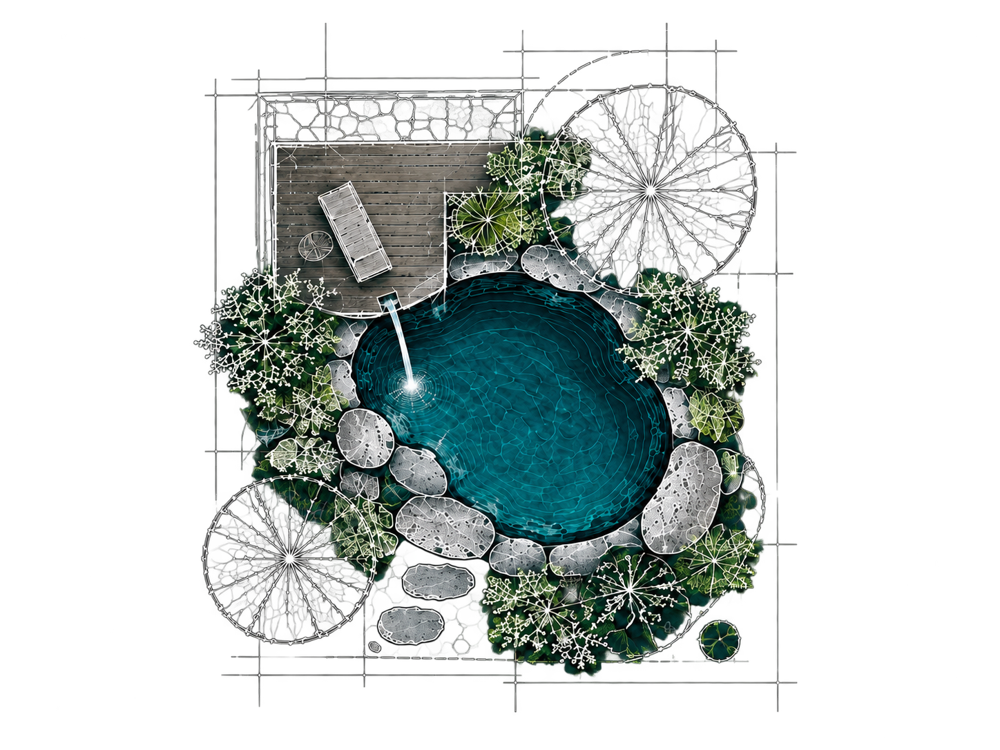
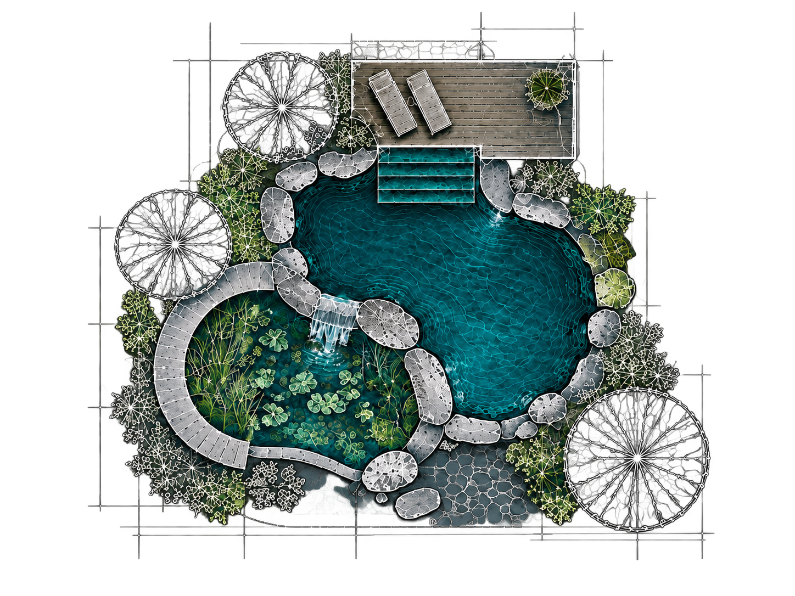
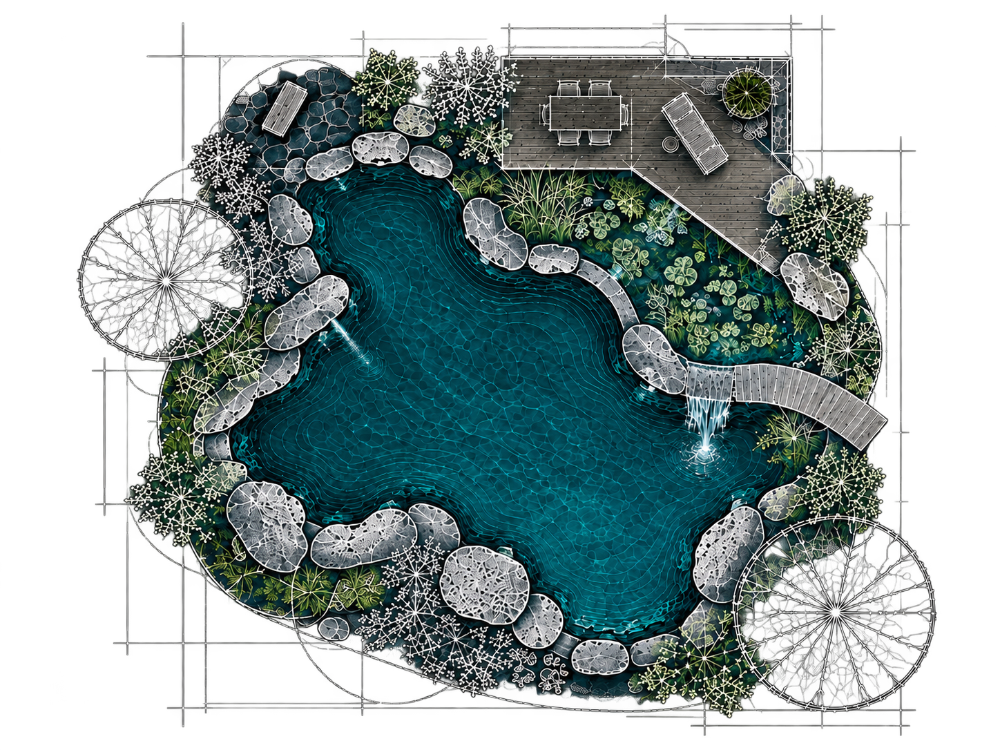

# Luminous landscape architecture blueprint

Owner-approved direction, 3 October 2026. Use this guide and the saved references together when
generating architectural pool plans for the public website. It defines a hybrid of a detailed
landscape architecture drawing and selectively rendered water, stone, timber and planting.

This is the style authority for these illustrations. The separate
[photography guide](PHOTOGRAPHY-STYLE.md) governs photographs; its soft focus and candid-camera
rules do not apply here. These plans are concept illustrations, not construction documents,
scaled engineering drawings or evidence of completed customer installations.

## Approved visual references

These snapshots preserve the approved designs after background removal. Supply them as image
references rather than relying on the style name alone. For an edit, identify the existing image
as the edit target and the relevant snapshot as the style reference.

### Small — Daily dips



### Medium — Swim together



### Large — More room



The three production assets are `public/assets/images/faunapoolen/editorial/package-glade.png`,
`package-summer.png` and `package-horizon.png`. Keep these URLs stable when replacing their artwork.

## Visual language

- View straight down, with a perfectly vertical, orthographic plan perspective. Keep the entire
  drawing sharp, including the outer construction lines.
- Build the drawing from extremely fine white, silver-grey and pale cyan lines: material
  hatching, alignment guides, dashed construction lines, small intersections, registration marks,
  architectural outlines and water-depth contours. Some guides extend beyond the landscape.
- Render the water more richly than its surroundings: deep petrol blue and dark turquoise,
  visible depth, fine underwater contours, subtle caustics and ripples around actual water entries.
  Small lights may create local cyan illumination; the whole pool must not glow.
- Use organic, asymmetric shorelines with irregular natural boulders of varied sizes. Stones may
  project into the water. Keep the landscape intentionally designed without mirrored arrangements
  or conventional rectangular pool geometry.
- Show trees as circular canopy diagrams with fine branching. Layer shrubs, grasses, reeds,
  aquatic plants and planting symbols naturally. Use muted moss, olive and forest greens.
- Give stone fine stippled or fractured texture and timber individual boards in desaturated
  brown-grey. Paths, steps, decks, furniture and planting should make a coherent garden plan.
- Use large, readable shapes supported by dense secondary detail. The design should read at the
  actual package-card size and reward a closer view. Detail must not become a solid white mass.
- Choose garden features to suit the specific scene; do not add every possible feature to each
  image. An illustration does not change the package's stated inclusions.

## Background and framing

**Website deliverables must have genuine alpha transparency.** Remove the flat backdrop around
and between the drawing's outer lines. Retain the water, stone, timber and planted areas with
appropriate opacity. Preserve fine antialiased edges without a coloured matte, feathering or halo.
The website supplies its own background, so there is no visible rectangular colour boundary.

The supplied ChatGPT description specified a solid `#011922` backdrop and prohibited transparency.
That instruction is superseded for website delivery by the owner's subsequent request to match
the actual page background. The rendered site was measured as `rgb(0, 25, 34)` / `#001922` on
3 October 2026. Do not bake either hex value into production images or hard-code a page colour
from this document. Use the current page surface when previewing transparent exports.

The supplied description also suggested 16:9. The approved package images are **1448 × 1086
(4:3)** and the existing package presentation contains them within a 3:2 image area. Preserve that
established framing for replacements: show the full illustration without stretching or cropping.
For a new placement, use its agreed aspect ratio. Leave space for the outer drafting lines, with
the design occupying approximately 80–90% of the canvas in its longest direction. Keep comparable
framing and line weights across a set; these concepts are not drawn to a common engineering scale.

## Reusable master prompt

Keep this style block unchanged across a set. Append the scene brief and output format below it,
and attach the relevant approved reference. For edits, explicitly require preservation of the
existing scene, geometry, composition and materials.

```text
Create a landscape architecture presentation drawing in the approved luminous landscape
architecture blueprint style. Use the attached approved image as the visual style reference.
View the garden perfectly vertically from above, as an orthographic plan.

Combine an extremely detailed professional landscape architecture plan with selective rendering.
Use precise, very thin soft-white, silver-grey, pale-cyan and turquoise drafting lines,
construction guides, alignment marks, dashed guide fragments, contour lines, material hatching,
tree canopy diagrams, botanical symbols, stone textures, timber board patterns and architectural
outlines. Extend some fine construction lines into the empty space around the garden.

Render the water more richly than the surrounding plan. Use deep petrol-blue and dark-turquoise
water, fine underwater depth contours, subtle caustic patterns and localized ripples around the
water entries specified in the scene. Actual lights may produce small cyan pools of illumination;
never make the whole water surface or composition glow.

Use naturally curved, irregular pool shorelines, varied natural boulders and asymmetric planting.
Integrate the scene's selected decks, paths, entry steps, furniture and planted filtration areas
into a coherent garden. Avoid conventional rectangular pools, mirrored layouts and evenly spaced
landscape objects. Follow the supplied scene brief rather than adding every possible feature.

Maintain fine detail throughout: branching inside tree-canopy circles, fractured or stippled
stone, individual timber boards, overlapping botanical drawings and many delicate water contours.
Keep the major pool shape legible at website-card size. Avoid dense white clumps of detail.

Use a restrained palette of soft white, silver-grey, stone grey, muted moss, olive and dark forest
green, desaturated brown-grey timber, deep petrol blue, dark turquoise and limited cyan highlights.
Keep every part sharply defined, including the outermost drafting lines.

Deliver a genuine transparent background with clean antialiased edges. Preserve the water and
material rendering while leaving empty backdrop areas transparent, including between outer
construction lines. No solid backdrop, dark rectangle, gradient, vignette, feathered perimeter,
haze, depth of field, soft focus, generalized glow or coloured edge halo.

No people, text, labels, written dimensions, prices, logos, annotations, borders or decorative
frames. No tropical resort aesthetic, bright lawn green, perfect symmetry, aerial photography,
plain CAD wireframe or simplified icon treatment. The result is a richly detailed architectural
concept plan with selectively rendered materials and water.
```

## Scene briefs for the package set

Use the corresponding approved snapshot to anchor composition. These briefs describe the existing
visual concepts, not a promise that every pictured garden feature is included in the price.

| Package                         | Scene brief                                                                                                                                                                                                                                                                       |
| ------------------------------- | --------------------------------------------------------------------------------------------------------------------------------------------------------------------------------------------------------------------------------------------------------------------------------- |
| Small / glade / Daily dips      | Compact, rounded natural plunge pool with an irregular stone edge, modest timber sitting deck with one lounger, a small water entry, a few tree-canopy diagrams and layered planting. Keep the garden compact and the pool dominant.                                              |
| Medium / summer / Swim together | An elongated, asymmetric swimming pool with entry steps beside a timber deck and two loungers. A connected planted water area, a curved timber path and varied trees and shrubs give it a fuller garden setting. Follow the approved medium plan's arrangement.                   |
| Large / horizon / More room     | A broad, irregular lagoon with several bays, substantial boulders, a planted filtration area, multiple water entries, a curved timber crossing and a larger deck with seating and a dining table. Give the landscape more spatial variety while preserving an open swimming area. |

Append this format instruction for a package replacement:

```text
Output: one transparent PNG, 4:3 landscape canvas, matching the approved 1448 × 1086 framing.
Keep the entire plan and its outer construction lines inside the canvas. Preserve the reference's
relative scale, breathing room and delicate line weights. Do not crop, stretch or add a frame.
```

## Generation and acceptance

1. Use built-in imagegen, one image per scene, with the approved snapshot attached and
   `transparent_background: true`. Do not regenerate approved artwork for a background-only fix;
   use an edit that preserves its composition. The prior background-extraction prompt is recorded
   in [the image-generation record](EDITORIAL-IMAGE-GENERATION.md#background-removal).
2. Inspect the actual alpha channel. A checkerboard or a solid dark field painted into the image
   is not transparency. Preserve the generated alpha when exporting.
3. Compare against the reference: vertical perspective, main geometry, restrained palette,
   fine crisp linework, water depth, natural materials and coherent connections between elements.
4. Inspect all outer edges against the actual site surface. Reject visible rectangles, coloured
   fringes, opaque backdrop remnants, lost guide lines, fading, blur or glow around the perimeter.
5. Review the full set in the pricing section on desktop and mobile. Check whole-image framing,
   comparable scale and line weights, readable pool shapes and no cropping or overflow.
6. Save the selected output in the project, retain stable public URLs, and record the scene prompt,
   reference and generation method in the image-generation record. Keep these approved reference
   snapshots unchanged unless the owner approves a new style reference.
