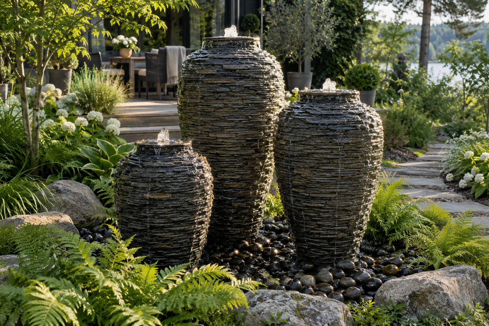

# Fountain concept image

The Waterscapes page uses `public/assets/images/faunapoolen/editorial/waterscape-fountain.webp` (1536 × 1024), generated on 3 October 2026.

## Product basis

Inspired by [Aquascape’s Stacked Slate Urns](https://www.aquascapeinc.com/products/stacked-slate-urn), arranged in three heights. The catalogue describes lightweight fibre-resin fountains with a stacked-slate appearance. This is an AI concept setting based on the product description, not an exact catalogue reproduction or a photograph of a completed Faunapoolen installation. No catalogue photograph was used as an image reference.

## Generation prompt

Create a new photorealistic garden photograph inspired specifically by the real Aquascape Stacked Slate Urns fountain product range, not a generic bubbling boulder. Landscape 3:2, 1536 × 1024. Three substantial sculptural Aquascape-style stacked-slate urn fountains at different heights (approximately 140 cm, 114 cm and 85 cm) form an asymmetrical garden focal point. Tall tapered rounded urn silhouettes: narrower circular bases, broad curved bellies and shoulders, narrowing to small open necks; layered thin horizontal slate-like ledges, dark charcoal and warm grey stone-look surfaces. Gentle water bubbles from each open top, sheets and trickles over the layered sides, collects in wet rounded pebbles concealing the reservoir. No visible plumbing. Largest urn slightly behind centre, medium right and smaller left, enough separation for their silhouettes. Fountains dominate the frame at useful card size. Integrated into a lush Swedish home garden: ferns, soft grasses, restrained white flowering plants, a few natural boulders and a worn stone path toward a timber terrace partially visible behind. A believable domestic installation, no palace or resort. Natural late afternoon directional light highlights moving water against darker foliage; realistic deep shade, occasional bright reflections, restrained natural greens and warm grey urns. Experienced photographer’s eye with a casual well-taken iPhone photograph feel, human eye-level three-quarter view, informal asymmetrical composition. Clear fountain silhouettes and realistic water, subtle physical depth of field, gently softened near foliage and distant garden. Smooth photographic tonality, no HDR, excessive microcontrast, oversharpening, crunchy texture, artificial grain, cinematic orange-teal grade, unreal glowing water or fire. No people, logos, text or borders. This is an AI concept garden setting based on Aquascape’s inventory, not a copied catalogue photograph.

## Source and preparation

Generated source: `exec-bcd2b91f-7dcd-4b6b-a1f4-23121e3aaa64.png` in the session’s generated-images directory. Converted to WebP at quality 94 without additional sharpening, grading or cropping. Follow [the photography style](PHOTOGRAPHY-STYLE.md) for future variants.
