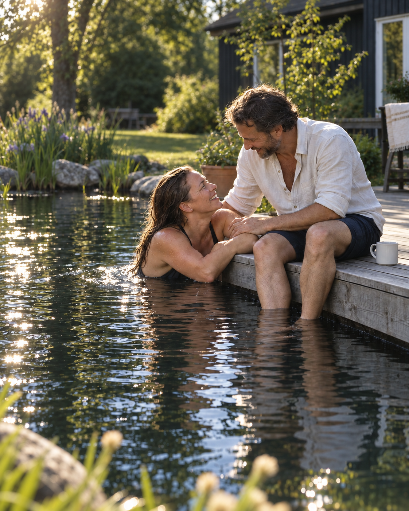

# Candid garden photography with natural depth

Owner-approved on 3 October 2026. This is the current photographic direction for the public
website. Use the description and reference together: the image calibrates contrast and, especially,
the restrained amount of optical softness. Earlier generation prompts remain provenance, not the
current style authority.

## Reusable direction

Photograph a real-feeling moment between people enjoying their garden and water. Use the eye of an
experienced photographer, with the spontaneity of a family member taking a casual phone photograph.

Capture relaxed closeness, spontaneous smiles and gestures during an interaction. People are
absorbed in each other or their surroundings, rather than performing for the camera. Do not add
people where the subject is a landscape, water detail, maintenance task or equipment.

Use directional available light, deeper natural shadows and bright, believable highlights. Let
some shadow detail disappear and occasional sunlit highlights approach clipping. Keep colours
restrained and skin tones natural. Preserve the scene's time of day: evening scenes get their
contrast from remaining daylight and plausible practical lights, not invented sunshine.

Use **gentle optical depth of field**: faces and meaningful gestures remain in focus, while the
background softens enough to separate the people from their surroundings. The garden stays
recognisable. Preserve water texture and reflections; soften only the nearest foreground more
noticeably. For images without people, choose the existing meaningful subject as the focus plane.
Broad landscapes need much less separation than intimate details.

Keep framing slightly informal, materials naturally weathered and planting irregular but cared
for. Imperfection is incidental, never deliberately dirty or shabby.

Avoid HDR, lifted shadows everywhere, crunchy detail, enhanced local contrast, oversharpening,
artificial grain, cinematic colour grading, glowing water, heavy bokeh and glossy advertising poses.

## Calibration

- The approved reference has stronger natural light and deeper shade than the initial couple image.
- The first blur revision was rejected because the background and foreground became too diffuse.
  The approved revision retains recognisable shrubs, house details and water ripples. Do not use
  a fixed aperture number as a substitute for this visual reference.
- Keep people and their interaction naturally resolved without sharpening them against a smeared
  background. Focus falloff follows physical distance; no cutout edges or portrait-mode halos.
- A good edit preserves the scene, subject, composition, anatomy, reflections, materials and
  existing attribution. It changes photographic treatment, not product facts or project evidence.

## Applying the reference

Supply the existing image as the edit target and the approved image above as the style reference.
State their roles explicitly. Preserve the target's aspect ratio, subject, people, place and time
of day. Adapt contrast and focus to the actual scene, without importing the reference's couple,
garden, colour cast or sunlight. Inspect faces, hands, water contact and reflections before use.

Case-study photographs, including every Gotland photograph wherever reused, remain untouched.
Architectural illustrations and plans remain untouched. Logos, certification marks and other
non-photographic assets are outside this treatment. Keep public image URLs stable.

AI concept imagery must not become evidence of a completed installation. Preserve source
attribution on supplier imagery; do not remove copyright marks or recast it as Faunapoolen work.

The reference was edited with the built-in Imagegen tool. Asset-specific prompts and the rollout
record live in [the editorial image record](EDITORIAL-IMAGE-GENERATION.md).
