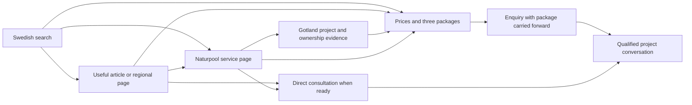

# Swedish SEO and package-led growth plan

16 September 2026 · Repository audit and proposed implementation brief · No website changes made

**Reading routes:** [priorities and findings](#1-the-outcome) · [keywords](#4-keyword-strategy-and-page-ownership) · [every current public page](#6-every-existing-public-page) · [price and regional pages](#7-new-commercial-and-regional-pages) · [every editable article](#8-existing-and-proposed-editorial-content) · [new guides](#9-new-guides-that-fill-genuine-buyer-questions) · [execution sequence](#15-implementation-sequence-and-priorities).

> **Owner-approved implementation, 17 September 2026:** all non-blog route slugs remain English in every language. Updated by the owner on 2 October 2026: starting prices are confirmed at 430,000 / 1,100,000 / 4,400,000 kr excluding VAT and shipping. Service covers all Sweden, with Denmark welcome; the four southern areas are search priorities, not a service boundary. See [implementation and verification](SEO-IMPLEMENTATION.md) for the final scope and external follow-through.

## 1. The outcome

Make Faunapoolen easier to find when Swedish homeowners are considering a naturpool, particularly in **Skåne, Halland, Blekinge and Småland**, and help that interest become a suitable project enquiry through the pool packages.

The commercial outcome is **qualified enquiries for projects we can deliver**, not simply more visits, more keyword appearances or more form submissions. Search visibility should bring people into the existing sales argument: a garden they enjoy more, a believable finished result, an understandable investment, and a manageable next step.

The recommended order is:

1. Protect the two successful articles and establish measurement.
2. Make the existing Swedish commercial pages specific about naturpooler and southern Sweden without replacing their sales story.
3. Create one substantial naturpool price-and-package destination.
4. Improve the ten editable articles and their routes into the relevant offer.
5. Publish regional pages when each has useful local substance.
6. Add a small number of distinct ownership guides and documented projects.
7. Use search and enquiry evidence to refine priorities.

This is an extensive plan, not an implementation or a publication instruction. Proposed wording below is a concrete writing brief; factual claims, prices and regional proof still need the evidence identified alongside them. There is no promise of a particular Google position or growth percentage.

## 2. What was actually audited

### Scope and evidence

The audit covers the current working tree, including the owner's uncommitted sales-story work: the route catalogue, all nine public page compositions, twelve article sources, Swedish translations, shared sales sections, package/enquiry flow, SEO generation, language handling, sitemap generation, redirects and preservation tests. The public admin and real operational database are outside the content audit.

The local browser was inspected without submitting an enquiry: the homepage, a package-to-enquiry journey, and the protected comparison article. Public live pages and the earlier 26-page Swedish sitemap crawl were used to distinguish deployed behaviour from the pending rebuild. No production data, secrets, private enquiries or operational logs were inspected.

**Three evidence levels must stay separate:**

| Evidence                                 | What it establishes                                                            | What it does not establish                                                |
| ---------------------------------------- | ------------------------------------------------------------------------------ | ------------------------------------------------------------------------- |
| Repository and local browser             | Current page copy, route intentions, package choices and predictable behaviour | What has been published or indexed                                        |
| Live public pages and crawl              | What the public site currently returns and links to                            | Google's chosen canonical, exact rankings or user behaviour               |
| Search research and Google documentation | Relevant vocabulary, intent differences and current search guidance            | Keyword volumes, difficulty, traffic, backlinks or conversion attribution |

Search Console, analytics access, backlink reports, field performance data and regional enquiry outcomes were not available in this audit. The keyword priorities are therefore based on product relevance and purchase intent, not fabricated volume estimates.

### The current site is different from the live site

The repository's accepted direction is documented in [the sales-story brief](COPY-REVIEW-STORYBRAND.md) and [the rebuild record](REBUILD.md). It has Swedish routes such as `/naturpooler/` and `/konfigurera/`, an emotional sales story, a completed Gotland case and a simpler enquiry flow. Earlier observations about live `/nature-pools.html`, `/pricing/` and older package names must not be copied into the plan as if they described this new implementation.

### Findings that determine the plan

| Finding                                                                    | Evidence in the current repository                                                                                    | Consequence and correction                                                                                                             |
| -------------------------------------------------------------------------- | --------------------------------------------------------------------------------------------------------------------- | -------------------------------------------------------------------------------------------------------------------------------------- |
| Southern Sweden is not the clear service-area message                      | About and FAQ still describe Sweden and selected EU work; the four priority areas are absent from key commercial copy | State the southern priority clearly while preserving truthful availability elsewhere                                                   |
| Several public search titles are generic                                   | `site.routes.ts` and Swedish `seo.*` translations include “Projekt”, “Guider”, “Om oss” and “Naturpooler”             | Give each title a specific search and sales purpose                                                                                    |
| Descriptions reuse page introductions                                      | `site.routes.ts` maps most descriptions directly to sales ingress                                                     | Author search descriptions separately where the sales sentence lacks topic, location or next-step detail                               |
| Price intent has no dedicated current destination                          | Legacy `/pricing/` maps to `/konfigurera/`; the form only shows a price after a package is selected                   | Add a real price/package page and redirect price links there                                                                           |
| Packages have useful commercial structure but unconfirmed commercial facts | Three shared packages with starting prices and swimming areas; existing briefs explicitly require confirmation        | Keep the three-card structure; settle price, included scope and exclusions before publishing price-led claims                          |
| The public article renderer omits stored introductions                     | `guide.page.html` renders title, image, contents and body, but not catalogue intro                                    | Restore original introductions as preservation work before publishing the rebuild; do not write new intros for the two protected posts |
| Current article protection is incomplete                                   | Tests protect body hashes and selected SEO fields but do not protect intro or the full article presentation           | Expand protection before shared article changes                                                                                        |
| Editorial routes into the offer are weak                                   | Six editable Swedish bodies have no contextual links; other bodies mainly point to the homepage                       | Add helpful, topic-specific paths to the naturpool page, package comparison and appropriate enquiry                                    |
| Shared related-reading content can change protected pages indirectly       | Related cards use other articles' current titles/descriptions                                                         | Keep protected recommendation presentation stable while editing other articles                                                         |
| Real proof is concentrated in one project                                  | Gotland photographs/films and two quotations from Brita; separate supplier-network examples                           | Build depth around the real case; do not imply multiple local projects or customers                                                    |
| Measurement could disappear in the rebuild                                 | Live pages contain Google tags; the current public source has no equivalent integration                               | Decide and verify measurement continuity before release                                                                                |
| Search-to-lead attribution is incomplete                                   | Enquiries record service/package/location/language but not a complete landing-source or qualification history         | Introduce a minimal, explicit measurement design and a qualified-lead review process                                                   |

These are priorities for the plan, not an assertion that all are current production defects. The missing introduction, redirect destination and tracking discontinuity are especially important **pending-rebuild** concerns.

## 3. Non-negotiable boundaries

### The two protected articles

These addresses stay exactly as they are:

- `/blog/posts/difference-between-normal-pool-and-natural-pool.html`
- `/blog/posts/build-your-own-nature-pool.html`

No keyword rewrites, updated headings, rewritten intros, new CTAs, inserted package modules, altered images, URL changes, new article schema or metadata improvements are proposed for them. Preserve the Swedish and English originals and the existing Danish representation. Keep their literal `.html` URLs, article-owned links, image URLs, indexability, canonicals and established language relationships.

“Do not edit the article file” is not sufficient. The protection must cover what shared templates and metadata generators produce. Before other work:

1. Record the protected live article content and SEO output, and compare it with the preserved historical baseline and current local render.
2. Restore the **existing original intro text** omitted by the pending renderer. This is recovery of retained content, not a new editorial revision.
3. Separate already-approved rebuild presentation changes from new SEO work. Do not silently treat pending changes to contents navigation, related reading, schema or language alternates as proven preservation.
4. Keep the protected article's own content and SEO stable in subsequent releases, including related-card labels/descriptions if a catalogue rewrite would change them. Use an explicit, content-owned protection policy in the existing rendering system; do not copy the entire old site into a parallel implementation.
5. Preserve original fixtures. Add reviewed expectations for authorized edits to the ten other articles; never regenerate the historical baseline to make regressions pass.
6. If a shared change cannot maintain protected output, exclude that change from the protected routes or defer it. No presumed permission to optimize these two.

Inbound links **to** these articles may be improved on other pages. An unchanged `/pricing/` link **from** a protected article may reach a more useful price page through the shared redirect catalogue; the article's URL and anchor stay unchanged. Test that destination explicitly.

### Preserve the sales story

Retain the accepted homeowner promise, the emotional opening and the progression from desire to evidence, investment and conversation. In particular:

- Homepage H1: **“Gör trädgården till hemmets bästa plats.”**
- Naturpool page H1: **“Ditt eget badställe, precis utanför dörren.”**
- Three package blocks presented together, using their current semantic roles and established framework composition.
- Real Gotland proof and Brita's exact approved quotations.
- A first phone consultation that is free; paid site visits and their credited fee explained at the relevant point.
- A package is an expression of interest, not a binding specification or a completed quotation.
- Visitors may ask for help without selecting a package. Pond and stream enquiries must remain possible without pretending they are pool buyers.

Search phrases go into informative titles, the immediate service sentence, useful headings and evidence. They do not require replacing the emotional H1 with a list of products and places. There is no keyword-density target or minimum word count.

### Preserve the implementation and publication boundaries

Use the established Angular/i18n content system, the published framework, shared route catalogue and typed enquiry contract. No new CMS, parallel content store, local framework substitute or paid content-generation dependency is part of this plan. No deployment, analytics-account change or outreach is performed by this planning work.

The existing commercial site has other legitimate services. Optimizing every public page means giving each an appropriate purpose; it does not mean forcing “naturpool Skåne” into golf, koi or rainwater advice.

## 4. Keyword strategy and page ownership

### Priority by customer intent

| Family                          | Swedish phrases                                                                                            | Preferred owner                                                              | Commercial purpose                                               |
| ------------------------------- | ---------------------------------------------------------------------------------------------------------- | ---------------------------------------------------------------------------- | ---------------------------------------------------------------- |
| Category                        | naturpool, naturpooler, naturlig pool                                                                      | `/naturpooler/`                                                              | Understand and choose a professionally built naturpool           |
| Broad regional brand/service    | naturpooler i södra Sverige, naturpooler Sverige                                                           | `/`                                                                          | Discover Faunapoolen's offer and actual service area             |
| Construction                    | anlägga naturpool, bygga naturpool, bygga naturpool med hjälp                                              | `/naturpooler/`                                                              | Move from interest to site suitability and professional delivery |
| Investment                      | naturpool pris, naturpool kostnad, vad kostar en naturpool, kostnad att anlägga naturpool, naturpool paket | Proposed `/naturpooler/pris/`                                                | Compare packages and understand the investment                   |
| Regional supplier               | naturpool Skåne/Halland/Blekinge/Småland; anlägga/bygga naturpool i respektive område                      | Proposed regional pages, initially a useful section on `/naturpooler/`       | Establish service availability and a local next step             |
| Overlapping category vocabulary | baddamm, anlägga baddamm, simdamm, ekologisk pool, biologisk pool, ekopool, biopool                        | Explanatory sections on `/naturpooler/` and the benefits/filtration articles | Meet different vocabulary without multiplying duplicate pages    |
| Alternative treatment           | pool utan klor, klorfri pool                                                                               | Filtration article and clarification on `/naturpooler/`                      | Explain the actual biological system and ownership requirements  |
| Existing pool                   | konvertera pool till naturpool, göra om pool till naturpool                                                | Existing conversion article                                                  | Qualify an assessment of an existing installation                |
| Ownership decisions             | naturpool skötsel, naturpool vinter, naturpool liten trädgård                                              | Dedicated guides with distinct questions                                     | Reduce uncertainty before package selection                      |
| Existing winning intent         | naturpool eller vanlig pool; bygga naturpool själv                                                         | The two frozen articles                                                      | Preserve established discovery routes                            |
| Adjacent water features         | anlägga damm, koidamm, bäck i trädgården, vattenfall i trädgården                                          | `/vattenmiljoer/` and relevant existing guides                               | Serve a separate, legitimate enquiry path                        |

Page ownership is an editorial decision, not a claim that Google will always rank that page. Measure query/page overlap before deciding that two appearances are harmful. Several relevant pages ranking is not automatically cannibalization.

### Use phrases where they help

| Surface                 | Planned use                                                                   | Limit                                                                                            |
| ----------------------- | ----------------------------------------------------------------------------- | ------------------------------------------------------------------------------------------------ |
| Search title            | Main topic plus useful distinction or geography, then Faunapoolen             | Concise and descriptive; no rigid character rule or promise that Google will display it verbatim |
| Meta description        | Summarize the specific offer/answer and useful next step                      | A search-result pitch, not a direct ranking lever or duplicate of every page's introduction      |
| H1                      | Clear page promise; retain approved emotional H1s on sales pages              | No forced list of synonyms or regions                                                            |
| First visible paragraph | Name naturpooler, our role and relevant service area early                    | Preserve the customer's desired outcome and readable Swedish                                     |
| H2/H3                   | Real questions about suitability, price, construction and care                | Do not add headings solely to repeat the keyword                                                 |
| Body                    | Answer the question with precise terms, examples and evidence                 | Explain related names; never imply all filtration systems are identical                          |
| Links                   | Describe the destination: prices, filtration, case or package comparison      | No repetitive blocks of exact-match links                                                        |
| Images                  | Accurate alt text and useful captions for actual subject/project              | Do not label a concept image as a completed Skåne project                                        |
| URLs                    | Preserve existing useful addresses; descriptive Swedish slugs for new content | No renaming the inherited article URLs to chase keywords                                         |
| Structured data         | Represent visible, verified facts consistently                                | No invented prices, locations, dates, authors, ratings or guaranteed rich results                |

Google's [SEO starter guide](https://developers.google.com/search/docs/fundamentals/seo-starter-guide) supports natural language and useful organization; its [title guidance](https://developers.google.com/search/docs/appearance/title-link) explains that result titles can draw on several page signals. The implementation should pursue clearer answers, not mechanically repeat every variation.

### Lower-priority terms

Keep `biopool`, `ekopool`, `simdamm` and `kemikaliefri pool` as monitored supporting vocabulary. Do not build a separate page for each synonym. “Pool utan klor” has mixed intent, including other treatment equipment; “bygga naturpool” mixes professional and DIY intent. Make our service explicit. Broad `pool`, `billig pool`, generic landscaping and English “natural pool Sweden” do not lead the Swedish growth programme.

Use natural Swedish in visible copy: a title can say “Pris på naturpool” while serving the query `naturpool pris`. Include relevant price variants such as `baddamm pris` or `biopool kostnad` only where a clear explanation genuinely applies to the offered system; monitor their actual query intent before expanding. Avoid the absolute promise “kemikaliefri” in new copy. Explain what treatment the offered system uses and, if verified, that it operates without added chlorine. Existing wording on the two frozen articles stays untouched.

## 5. The search-to-package journey

This is a navigation strategy, not a requirement to make every visitor complete every step. Keep a direct consultation route for ready visitors. Use the package comparison as the useful next step for people still judging scale and cost.

### Existing package truth to preserve and verify

| Swedish package  | Existing identifier | Swimming area shown | Current repository starting price |
| ---------------- | ------------------- | ------------------- | --------------------------------- |
| Dagliga dopp     | glade               | Från 17,5 m² badyta | 430 000 kr exkl. moms och frakt   |
| Bada tillsammans | summer              | Från 24 m² badyta   | 1 100 000 kr exkl. moms och frakt |
| Mer plats        | horizon             | Från 100 m² badyta  | 4 400 000 kr exkl. moms och frakt |

These prices and starting areas were confirmed by the owner on 2 October 2026 to match the live package overview. VAT and shipping are excluded. The site-specific quotation must establish the remaining scope and assumptions; do not infer an exclusion or inclusion from silence.

Keep prices in the existing shared package authority. Do not repeat manually maintained numbers in article text, metadata and local pages. Use the shared comparison or a deliberate maintained price reference; describe scope and link to current prices elsewhere. Swimming area is not the total land required.

### The price destination

Create **`/naturpooler/pris/`** as the one substantial destination for price, cost and package comparison. Keep the same three cards and package identities; do not create three thin pages for package names that have no demonstrated search demand.

The page must answer: what range of project is this, what is included, what changes the price, what additional space is needed, what remains to be assessed, and how to discuss a package. Use “Fråga om den här poolen” for the package action. It continues to `/konfigurera/?package=glade|summer|horizon` and preselects Naturpool.

Keep `/naturpooler/#packages` working. It is an existing useful comparison anchor. Link to the fuller price explanation from that section rather than removing the section or adding another competing package catalogue.

### Enquiry continuity

The local browser confirms a selected package reaches the form with its name and indicative price. Preserve that behaviour. Preserve optional package selection and the existing small set of contact fields. Do not insert a mandatory budget quiz or lengthy configuration before first contact.

Header language switching currently preserves the query; footer language links and the language-suggestion link do not. Preserve package/service context through those entry points as well, while keeping the canonical enquiry URL free of query parameters. Do not store contact data in URLs or analytics.

Count a lead only after the persisted receipt is confirmed, not on a submit-button click. Do not send synthetic enquiries to the real inbox as verification.

## 6. Every existing public page

The current Swedish catalogue has nine non-article pages and twelve articles: **21 Swedish canonical pages**, with corresponding English and Danish routes for **63 canonical pages**. The brief below covers every non-article page; section 8 covers every article.

All proposed titles/descriptions are Swedish drafts. They should be reviewed in actual result-preview widths and against the final visible content. Do not pad or truncate solely to reach a supposed ideal character count.

### P01 — Homepage `/`

**Job:** create desire, identify the offer, establish service area, show proof and make the investment approachable.

**Search ownership:** `naturpooler i södra Sverige`; supports brand and `naturpooler`. The service page owns the detailed category answer.

**Current gap:** broad service language and no clear southern focus. The emotional H1 is not a problem to fix.

- **Title:** `Naturpooler i södra Sverige | Faunapoolen`
- **Description:** `Vi utformar och bygger naturpooler i Skåne, Halland, Blekinge och Småland. Se vårt färdiga projekt, jämför poolpaket och prata med oss om din trädgård.`
- **H1:** retain `Gör trädgården till hemmets bästa plats.`
- **Ingress direction:** `Vi utformar och bygger naturpooler i södra Sverige för morgondopp, långa sommarkvällar och mer tid tillsammans.`

Retain the current emotional opening → Gotland proof → personal relevance → three packages → adjacent water features → process. Add a compact, useful service-area sentence near the offer or process naming the four areas; do not place all four names into every section. Keep ponds and streams as a supporting offer with their existing link.

Use a package-section heading such as **“Naturpoolspaket för din trädgård”**, with the existing explanatory line about swimming areas and starting prices. Keep the emotional headline and readable page length. Add the price-hub link where readers compare investment. Keep the primary consultation action and real-case secondary action rather than introducing a third hero button.

**Links:** `/naturpooler/`, `/naturpooler/pris/`, `/projekt/gotland/`, appropriate service-area destinations when published, and `/vattenmiljoer/`.

**Success:** Swedish non-brand entrances reach either the service/price page or an enquiry; package engagement and qualified enquiries improve without a rise in unsuitable contacts.

### P02 — Naturpool service `/naturpooler/`

**Job:** let a homeowner picture ownership and understand how Faunapoolen can build it.

**Search ownership:** `naturpool`, `naturpooler`, `anlägga naturpool`, `bygga naturpool`.

- **Title:** `Bygga naturpool – utformning och anläggning | Faunapoolen`
- **Description:** `Få en naturpool utformad för din trädgård. Läs om utrymme, biologisk rening och skötsel, jämför paket och se hur vi hjälper dig från idé till färdig pool.`
- **H1:** retain `Ditt eget badställe, precis utanför dörren.`
- **Opening:** keep the morning-swim/life-at-home promise, then explicitly name designing and building **naturpooler** and the four priority areas.

Recommended reading sequence, combining with existing sections rather than adding every item as a new panel:

1. `En naturpool för livet i din trädgård` — a short definition and how the offer relates to baddamm/biological filtration. Explain that system design varies.
2. `Får en naturpool plats i din trädgård?` — swimming area versus total installation, access, ground and filtration assessment.
3. `Jämför naturpoolspaket och priser` — existing three-card comparison at `#packages`, then the detailed price page.
4. `Så anlägger vi din naturpool` — reuse the real consultation/proposal/construction process, with paid site assessment explained.
5. `Så fungerar biologisk rening` — short actual-system explanation, then the filtration guide.
6. `Vad kräver en naturpool i skötsel?` — real tasks and seasonal support, then the ownership guide/FAQ.
7. Service-area sentence and useful regional links; real Gotland proof as evidence, correctly located.

Do not duplicate the protected comparison article's full argument. Link to it for that decision. Keep detailed engineering in guides, not between the desire and package comparison.

**Primary commercial next step:** package enquiry; **secondary:** free initial conversation without a package. A reader can go directly to either.

### P03 — Project overview `/projekt/`

**Job:** establish confidence through completed work without implying a larger portfolio than exists.

**Search ownership:** `naturpool inspiration`, `naturpool projekt`, brand plus projects.

- **Title:** `Naturpool – projekt och inspiration | Faunapoolen`
- **Description:** `Se Faunapoolens färdiga naturpool på Gotland och hör Britas berättelse. Upptäck hur bad, natursten och trädgård kan mötas i ett verkligt projekt.`
- **H1:** retain a clear, honest singular project promise; `Se en färdig naturpool` is a candidate if the current Gotland heading is revised.

Keep this a concise overview that introduces the documented case and leads to its full story. Do not repeat the full Gotland gallery, full quotation set and identical prose on both pages. Distinguish supplier-network inspiration from work completed by Faunapoolen. Do not label supplier photographs as our installations.

Add a short connection from inspiration to suitability: the example shows an outcome, while the customer's layout and quotation will depend on their own property. Link to package comparison without attributing a current package, budget or installation time to the Gotland project unless verified.

**Next step:** view Gotland → compare current packages. With more approved case evidence, this becomes a real project collection; no invented placeholder case pages.

### P04 — Gotland case `/projekt/gotland/`

**Job:** make the desired result credible through a real customer's experience.

**Search ownership:** `naturpool Gotland`, `naturpool projekt`, brand/project searches. Gotland remains truthful proof even though the growth focus is southern mainland Sweden.

- **Title:** `Naturpool på Gotland – Britas trädgård | Faunapoolen`
- **Description:** `Se fotografier och filmer från naturpoolen vi byggt på södra Gotland. Brita berättar om bygget och om livet vid vattnet med familjen.`
- **H1:** `Naturpool på Gotland`.

Place a compact case narrative beside the visual evidence: the customer's aim, verified work, and what they say about the result. Use only facts already substantiated. The record currently supports location, completed work, photographs/films and Brita's quotations. It does not support an invented budget, project duration, dimensions or quantified environmental benefit.

Candidate sections: `Ett eget badställe vid hemmet`, `Brita om bygget`, `Livet med naturpoolen`, and a short invitation to compare an appropriate project scale. Preserve exact customer wording and distinguish the two quotes as one person's account.

Keep actual project image URLs stable. Add useful captions to genuine photographs when they add information. Provide accessible film descriptions/transcripts where rights and source material permit. Only propose video structured data when the page and available facts meet current requirements; the presence of an iframe alone is insufficient.

**Next step:** `/naturpooler/pris/`, with a direct consultation option. Never relocate this case to a target county in alt text or schema.

### P05 — Water features `/vattenmiljoer/`

**Job:** convert the separate pond/stream/waterfall audience and support a coherent garden offer.

**Search ownership:** `anlägga damm`, `koidamm`, `bäck i trädgården`, `vattenfall i trädgården`.

- **Title:** `Dammar och vattenfall i trädgården | Faunapoolen`
- **Description:** `Vi utformar och anlägger dammar, bäckar och vattenfall för din trädgård. Utforska alternativen och prata med oss om platsen, skötseln och dina idéer.`
- **H1:** retain `En egen plats att varva ner.`; name the actual installations immediately beneath it.

Keep the current enjoyment-led distinctions: watching fish, hearing moving water, sitting beside still water. Make headings name the relevant installation as well as the experience. State individual quotation rather than applying pool-package prices to ponds.

Use regional availability once, where it answers whether the team can help. Link to the corresponding garden, small-space and algae guides. Offer a contextual branch: visitors seeking a place to swim can explore `/naturpooler/`.

**Next step:** an enquiry with the actual service interest. Do not force a non-swimming prospect through the three pool packages.

### P06 — Blog index `/blog/`

**Job:** help visitors find the answer that advances their decision.

**Search ownership:** `naturpool guide`, `naturpool frågor`, broad planning and ownership discovery.

- **Title:** `Guider om naturpooler, pris och skötsel | Faunapoolen`
- **Description:** `Läs om att planera en naturpool, biologisk rening och skötsel. Hitta svar inför ditt projekt och gå vidare till poolalternativ och aktuella priser.`
- **H1:** `Guider om naturpooler`.

Retain the two protected articles' established titles and prominent discoverability. Group the rest by a small number of useful questions: choosing/planning, water/care, and other garden water features. A simple editorial grouping is sufficient at this size; no new search/filter interface is required.

Write distinct summaries for editable articles that state the answer or decision offered. Do not repeat the same generic company description. Ensure every published guide has a crawlable link from the index. Keep the strongest existing internal routes to the two protected posts; do not remove them in a cosmetic reordering.

Add one compact bridge to current pool options and prices. Avoid turning every card into a sales pitch. Article content should earn the transition.

### P07 — About `/om/`

**Job:** answer who takes responsibility for a substantial project.

**Search ownership:** brand, `naturpoolsbyggare`, expertise/service-area support. This is not another page competing for the complete `naturpool pris` answer.

- **Title:** `Om Faunapoolen – vi bygger naturpooler`
- **Description:** `Lär känna Faunapoolen och hur vi tar ansvar för utformning, anläggning och skötsel. Vi fokuserar på naturpooler i södra Sverige.`
- **H1:** retain `Om Faunapoolen`.

Make southern priority explicit without falsely claiming that work elsewhere has ceased. Explain the real company role, actual contact details, the Aquascape relationship and what the certification supports. Link to its authoritative source and the real case. Do not invent an author biography, credentials, project totals, offices or “leading in Sweden” claims.

Add a concise service-area section with the four regions and real logistics/coverage information when confirmed. Keep one brand/company entity and authentic contact identity across the site. A published technical reviewer can be credited here only if that person actually reviewed the work and agrees to the attribution.

**Next step:** view work, compare packages, or request a conversation.

### P08 — FAQ `/vanliga-fragor/`

**Job:** resolve purchase and ownership objections quickly.

**Search ownership:** long-form questions about naturpool space, cost, care, process and service area.

- **Title:** `Vanliga frågor om naturpooler | Faunapoolen`
- **Description:** `Svar om utrymme, kostnad, biologisk rening och skötsel av naturpooler. Läs också om rådgivning och hur ett projekt med Faunapoolen börjar.`
- **H1:** `Vanliga frågor om naturpooler`.

Make vague current questions more specific: `Hur mycket plats behöver en naturpool?`, `Vad kostar en naturpool?`, `Hur sköter jag en naturpool?`, `Vad händer med naturpoolen på vintern?`, `Bygger ni naturpooler i Skåne, Halland, Blekinge och Småland?`.

Answer directly, then link to the page that owns detail. The cost answer links to current prices; the space answer distinguishes swimming area from the whole installation; the winter answer remains system-dependent; the area answer states actual coverage. Do not promise a free design or quote during the free first call.

Keep FAQs useful to people. **Do not justify work with FAQ rich-result expectations:** Google's current changelog says that feature stopped appearing on 7 May 2026. [Google's update record](https://developers.google.com/search/updates).

### P09 — Enquiry `/konfigurera/`

**Job:** turn informed interest into a reliable, easy first conversation.

**Search ownership:** brand/contact and `rådgivning naturpool`; it is not the principal price-ranking page.

- **Title:** `Rådgivning om naturpool – kontakta Faunapoolen`
- **Description:** `Berätta om din trädgård och dina idéer. Välj ett poolpaket om du vill eller låt valet vara öppet. Första telefonsamtalet är kostnadsfritt.`
- **H1:** retain `Ta reda på vad som passar din trädgård.`

Keep the existing concise form and contact-field order. If a package was selected, show it clearly with the correct indicative price and preserve it through refresh and supported language changes. Keep the “not sure” path. No need to require an exact budget or exact site dimensions before first contact.

Maintain one canonical contact destination. `?package=...` and `?service=...` carry form state; they are not indexable package landing pages and must not appear as sitemap entries. Preserve typed validation, retries, receipt confirmation and the private inbox boundary.

Provide a relevant route back to package comparison for undecided pool visitors. Keep errors and receipt copy operational; do not add keyword text to error messages or successful submission states. Track verified receipt separately from attempted submission.

## 7. New commercial and regional pages

### N01 — Prices and packages `/naturpooler/pris/`

**Priority:** first new commercial page, after package facts are confirmed.

- **Primary phrases:** `naturpool pris`, `naturpool kostnad`, `vad kostar en naturpool`.
- **Supporting:** `naturpool paket`, `kostnad att anlägga naturpool`.
- **Title:** `Pris på naturpool – jämför paket | Faunapoolen`
- **Description:** `Jämför naturpoolspaket, badytor och vad som ingår. Se vad som påverkar kostnaden och fråga oss om ett upplägg för din trädgård.`
- **H1:** `Vad kostar en naturpool?`
- **Opening:** a direct, verified price answer followed by the qualification that site, access, scope and choices determine the quotation. Do not hide the answer behind an enquiry.

**Page sequence:**

1. Current starting-price explanation and tax/scope context.
2. Three adjacent package cards with consistent comparison categories and preserved package actions.
3. `Vad ingår i våra naturpoolspaket?` — only commercially confirmed inclusions; distinguish designed features from installed ones.
4. `Vad påverkar kostnaden för en naturpool?` — site, access, ground, size, materials and selected work; use concrete examples without invented estimates.
5. `Badyta och total yta – vad är skillnaden?` — avoid implying the swimming rectangle is all the land needed.
6. `Drift och skötsel efter bygget` — tasks and cost categories; numerical examples only from a defined, sourced scenario.
7. `Från poolpaket till förslag och offert` — the actual first conversation, paid assessment and quotation process.
8. Real case evidence and a concise question/answer section addressing cost uncertainty.

**Entry links:** home package section, service page, cost FAQ, editable relevant articles, regional pages and protected articles' unchanged old price links through redirects.

**URL policy:** `/pricing/` should redirect directly here in Swedish; equivalent legacy locale paths should reach their corresponding translated price page. Preserve supported fragments or provide equivalent targets where old inbound links refer to a service section. Price-page creation and redirect changes ship together. Do not point all unrelated legacy water-feature fragments to an irrelevant pool price section; map their intent explicitly in the legacy ledger.

**Proof before publishing:** offer scope signed off by the business, one maintained price authority, correct VAT wording, package persistence and a real price answer in initial HTML.

### Regional strategy

Create the four candidates below only after each can stand alone as a useful service page. In the first commercial-copy release, state the four areas clearly on the existing homepage, naturpool page, About and FAQ. This provides accurate coverage while regional evidence is collected.

The common service can be explained consistently, but each separate page needs useful area-specific content. No fabricated completed project, office, local expert, soil condition or planning rule. A regional project is strong evidence, but is not the only way to make a page useful: actual coverage, consultation logistics, a sourced local question and accurately labelled nearby/reference work can help. If the page would only swap a place name, do not publish it yet.

| Candidate                | Title                                                       | H1                                         | Main query families                                    |
| ------------------------ | ----------------------------------------------------------- | ------------------------------------------ | ------------------------------------------------------ |
| `/naturpooler/skane/`    | `Naturpool i Skåne – från idé till bad \| Faunapoolen`      | `En naturpool för din trädgård i Skåne`    | naturpool Skåne; bygga/anlägga naturpool i Skåne       |
| `/naturpooler/halland/`  | `Naturpool i Halland – utformning och bygge \| Faunapoolen` | `En naturpool för din trädgård i Halland`  | naturpool Halland; bygga/anlägga naturpool i Halland   |
| `/naturpooler/blekinge/` | `Naturpool i Blekinge – från idé till bad \| Faunapoolen`   | `En naturpool för din trädgård i Blekinge` | naturpool Blekinge; bygga/anlägga naturpool i Blekinge |
| `/naturpooler/smaland/`  | `Naturpool i Småland – utformning och bygge \| Faunapoolen` | `En naturpool för din trädgård i Småland`  | naturpool Småland; bygga/anlägga naturpool i Småland   |

**Skåne brief:** Explain actual service coverage and how a property visit is arranged. Investigate genuine project/partner material and relevant customer questions for Malmö/Lund, Helsingborg or Kristianstad only where the company serves them. Do not insert all towns as a keyword block. Candidate description: `Vi utformar och bygger naturpooler i Skåne. Utforska poolpaket och prata med oss om din tomt, dina idéer och nästa steg.`

**Halland brief:** Establish that this is a private-garden design/build service; regional results also contain spa and visitor-destination intent. Obtain actual coverage/logistics for places such as Halmstad, Falkenberg and Varberg. Discuss access and exposure only as site-assessment questions, not blanket regional conditions. Candidate description: `Planerar du en naturpool i Halland? Se hur vi hjälper dig från idé till anläggning, jämför paket och berätta om din trädgård.`

**Blekinge brief:** Establish availability and the practical first step. Seek real customer/partner evidence and useful coverage around Karlskrona, Ronneby or Karlshamn where accurate. Do not claim rock excavation, coastal conditions or special requirements apply to every property. Candidate description: `Utforska naturpooler för din trädgård i Blekinge. Vi hjälper dig med utformning och anläggning utifrån platsen och dina önskemål.`

**Småland brief:** Use the consumer-facing area name Småland; do not treat it as one administrative authority. Establish actual service coverage, including places such as Växjö, Kalmar or Jönköping where served. A legal/planning question must point to the relevant municipality, not a fictional common county rule. Candidate description: `Vill du anlägga en naturpool i Småland? Jämför poolpaket och prata med oss om utrymme, utformning och förutsättningarna på din tomt.`

**Each regional page needs:** an immediately recognizable offer; actual availability; evidence accurately labelled by location; a useful explanation of assessment and logistics; a brief package comparison or link to current prices; two or three real regional customer questions; and a clear package/consultation action. Facts and questions distinguish the pages, not synonym rotation.

Link from the naturpool service-area section to these pages. Each links back to the main service, pricing and the relevant evidence. Avoid a city-page expansion until qualified demand and unique material justify it. Google's [doorway guidance](https://developers.google.com/search/docs/essentials/spam-policies#doorway-abuse) is a reason to make regional destinations useful, not a reason to avoid accurate location information.

## 8. Existing and proposed editorial content

The ten editable articles each need one distinct question, a clear opening answer, appropriate evidence and a relevant next step. The briefs below identify current gaps, proposed Swedish metadata, headings, sources and conversion links. Approximate existing word counts describe the audit; they are not length targets.

The two protected articles remain unchanged. Their useful pattern—recognizable buyer questions, natural Swedish naturpool terminology, substantive answers and an established crawlable place in the site—is worth applying elsewhere. This is a plausible explanation for their relevance, not proof of Google's ranking causes. Their reported positions do not establish backlink strength or identify which single feature produced the result.

**Shared editorial rules:**

- Start with the answer or decision the visitor came for. Use a short lead before a long contents list.
- Write idiomatic Swedish for homeowners. Prefer naturpool as the consistent main term when that is the subject; explain related terms instead of rotating synonyms mechanically.
- Use a useful contextual link when the reader is ready to consider cost, suitability or professional help. One final action is enough; no full package grid in every article.
- Preserve all existing article URLs and public image URLs. Correct eligible captions and evidence labels where needed; do not imply old foreign inspiration images show our work.
- Use reviewed technical sources, the actual offered system and verified project evidence. Unsupported health, ecological, financial, safety or customer claims must be sourced, qualified or removed before reuse.
- Retain publication history and use a real modification/review date after substantive review. Do not invent a reviewer or renew dates on every build.
- Apply edits through the current English source and Swedish/Danish catalogues. Check all published translations; do not introduce a separate Swedish article authority.

**Important sales constraint:** the existing enquiry supports `pool`, `pond`, `stream` and `unsure`. There are no dedicated golf, maintenance, rainwater or conversion service identifiers. Use the supported choice or neutral enquiry with the existing notes field; confirm the service before advertising it.

### E01 — Five common problems

**Current URL:** `/blog/posts/5-common-problems-installing-a-nature-pool.html`  
**Current Swedish H1:** 5 vanliga problem med naturpool och pool utan klor  
**Current subject:** ecosystem imbalance, position, leakage, circulation and plants; approximately 422 body words.

**Distinct intent:** a prospective customer wants to avoid a bad installation and know what a professional must plan. Cluster: `problem med naturpool`, `naturpool problem`, `planera naturpool`. The frozen DIY guide continues to own doing the work yourself; the algae article owns diagnosis after a problem occurs.

**Gaps:** offers generic prescriptions about sun/shade, clay sealing, depth and named plants without system conditions; does not explain what the installer checks, what the customer should ask, or how the commissioning/handover confirms readiness.

**Proposed title tag:** `Problem med naturpool: 5 risker att planera för | Faunapoolen`  
**Proposed H1:** `5 problem med naturpool att förebygga redan i planeringen`  
**Proposed meta:** `Placering, tätning, vattenflöde, filtrering och växtval påverkar naturpoolen. Se vad som behöver bedömas innan bygget börjar.`

**H2 outline:**

1. När reningen inte matchar badytan och användningen
2. När löv, ytvatten eller jord belastar poolen
3. När underlag och tätning inte passar platsen
4. När vattnet inte cirkulerar genom hela systemet
5. När växter och skötselplan väljs för sent
6. Det här ska ingå i genomgången före byggstart

Explain each as condition → possible consequence → what is assessed, not as a universal installation recipe. Add a brief owner checklist, based on actual process.

**Evidence required:** Faunapoolen's assessment checklist; reviewed Aquascape sizing and commissioning principles; permitted local plant list; real photos/details of at least one construction decision. Remove universal dimensions/timings unless system-specific evidence supports them.

**Links and CTA:** filtration article, algae article, frozen DIY guide for those who specifically want to build themselves; packages at the professional-planning section. Final CTA: **Se poolalternativ och frånpriser** → `/naturpooler/pris/`.

### E02 — How filtration works

**Current URL:** `/blog/posts/how-filtering-works-with-nature-pools.html`  
**Current Swedish H1:** Biologisk filtrering i naturpool: så renas pool utan klor  
**Current subject:** plants, gravel, bacteria, circulation, then broad environmental benefits; approximately 268 words.

**Distinct intent:** understand how the offered pool keeps water in usable condition. Cluster: `naturpool rening`, `naturpool filter`, `biologisk rening naturpool`. Avoid another general comparison article.

**Gaps:** does not clearly distinguish capture/removal of debris from biological processes; no visual flow, maintenance dependency or explanation of what the owner does; implies clear water means safe swimming; broad claims about cleaning surrounding waterways do not follow from an isolated pool.

**Proposed title tag:** `Så fungerar reningen i en naturpool | Faunapoolen`  
**Proposed H1:** `Så renas vattnet i en naturpool`  
**Proposed meta:** `Följ vattnets väg genom naturpoolen: skräpuppsamling, biologiskt filter och cirkulation. Läs om reningen och skötseln den behöver.`

**H2 outline:**

1. Från badyta till filter och tillbaka
2. Så fångas löv och annat skräp upp
3. Vad mikroorganismerna gör i filtret
4. Växternas roll i den lösning vi bygger
5. Därför behöver vattnet cirkulera
6. Det här behöver du kontrollera och sköta

Use one clear, accurate flow diagram of Faunapoolen's actual system. Distinguish system variants rather than asserting every naturpool needs the same regeneration area.

**Evidence required:** actual offered system components and diagram reviewed by the technical owner; source for each filtration function; operation and monitoring plan; commissioned water-quality requirements. No guaranteed bacterial safety based on appearance.

**Links and CTA:** problems article, algae article, seasonal-care guide when published; contextual link to `/naturpooler/` and packages. Final CTA: **Jämför naturpoolspaket** → `/naturpooler/pris/`.

### E03 — Algae and maintenance

**Current URL:** `/blog/posts/algae-control-and-maintenance-tips.html`  
**Current Swedish H1:** Alg i damm? Skötsel av koidamm och vattenlandskap  
**Current subject:** general algae causes, plants, beneficial bacteria, a customer anecdote, routine tasks; approximately 568 words.

**Distinct intent:** understand an actual algae problem, separating decorative/fish ponds from swimming water. Cluster: `alger i naturpool`, `alger i damm`, `grönt vatten naturpool`. Detailed seasonal care belongs in the proposed new annual-care guide.

**Gaps:** no clear triage of surface growth versus green water; unsubstantiated customer story; one blanket cleaning frequency and a quoted 50% plant ratio; named plants not validated for Swedish conditions/current rules. Existing owner looking for help is sent toward an installation consultation.

**Proposed title tag:** `Alger i naturpool och damm: orsaker och åtgärder | Faunapoolen`  
**Proposed H1:** `Alger i naturpool eller damm – vad behöver du undersöka?`  
**Proposed meta:** `Grönt vatten eller trådalger? Läs om näring, cirkulation och skötsel, och vilka kontroller som hjälper dig att hitta orsaken.`

**H2 outline:**

1. Börja med att skilja på olika algproblem
2. Varifrån kommer näringen?
3. Kontrollera cirkulation och filter enligt din skötselplan
4. Så skiljer sig råden för baddamm och koidamm
5. När du behöver en bedömning av vattenkvaliteten
6. Förebygg återkommande problem

Keep advice within the system owner's verified guidance. Do not diagnose swimming safety remotely or propose a chemical/bacterial additive without checking suitability for the particular use.

**Evidence required:** dated, identified maintenance expert; actual maintenance instructions; approved plant/species guidance; verified case record before retaining customer anecdote or before/after outcome; product suitability for bathing use where any product is discussed.

**Links and CTA:** filtration and seasonal care; service route for an existing installation if offered. A restrained final subsection for prospective owners can link **Se hur vi planerar en naturpool** → `/naturpooler/`; do not make purchasing a new pool the only recovery path.

### E04 — Why choose a natural pool

**Current URL:** `/blog/posts/why-you-should-get-a-natural-pool.html`  
**Current Swedish H1:** Varför välja ekologisk pool utan klor?  
**Current subject:** nine sections of benefits; approximately 608 words.

**Distinct intent:** picture everyday ownership and decide whether the lifestyle and responsibilities fit. Cluster: `naturpool fördelar`, `naturpool i trädgården`, `leva med naturpool`. The frozen comparison article continues to own naturpool versus conventional pool; this article should tell the lived story, not repeat that comparison.

**Gaps:** unsupported immune-system, health, property-price and cost-saving claims; awkward Swedish such as “lågt underhållande”; contradictory implication that expensive filtration is unnecessary; one stale `/pricing/` link; no owner experience or practical trade-offs.

**Proposed title tag:** `Naturpool i vardagen: bad, trädgård och skötsel | Faunapoolen`  
**Proposed H1:** `Livet med naturpool: bad, trädgård och skötsel`  
**Proposed meta:** `Morgondopp, tid vid vattnet och en trädgård som förändras med årstiderna. Läs vad en naturpool ger i vardagen och vad den kräver.`

**H2 outline:**

1. En badplats som blir en del av trädgården
2. Så kan du använda platsen genom året
3. Skötseln som hör till
4. Utrymme, budget och förväntningar att ta ställning till
5. En ägares erfarenhet från Gotland
6. Välj ett poolalternativ efter hur du vill bada

Use the actual Gotland story and recorded testimony with permission and exact attribution. Preserve the emotional appeal—time together, a place to swim and sit—without unsupported outcomes.

**Evidence required:** owner-approved interview extracts; recorded operation/care experience where numbers are used; current inclusions/prices read from package owner. No promises of guaranteed savings or increased house value.

**Links and CTA:** actual Gotland case, frozen comparison, seasonal-care guide, package section. Final CTA: **Jämför våra poolalternativ** → `/naturpooler/pris/`.

### E05 — Pool conversions

**Current URL:** `/blog/posts/pool-conversions.html`  
**Current Swedish H1:** Konvertera klorpool till naturpool eller simdamm  
**Current subject:** reasons, construction outline, US contractor anecdotes, benefits and care; approximately 920 words.

**Distinct intent:** existing pool owner investigates conversion feasibility. Cluster: `bygga om pool till naturpool`, `konvertera pool till naturpool`, `göra om pool till baddamm`. Keep the existing path.

**Gaps:** detailed foreign-project claims and quotations lack provenance; images can be mistaken for documented before/after of the same project; no-pH-testing and two-week-ready implications are unsupported; no clear explanation of when conversion is unsuitable; conversion is not a standard new-build package.

**Proposed title tag:** `Bygga om pool till naturpool: vad behöver bedömas? | Faunapoolen`  
**Proposed H1:** `Kan din pool byggas om till naturpool?`  
**Proposed meta:** `Poolens skick, reningen och platsen runt omkring avgör om en ombyggnad är möjlig. Se vad vi behöver bedöma innan du går vidare.`

**H2 outline:**

1. Det avgör om den befintliga poolen går att använda
2. Plats för biologisk rening och cirkulation
3. Vad som kan behållas och vad som kan behöva byggas om
4. Så går bedömning, projektering och ombyggnad till
5. Vad som påverkar omfattning och kostnad
6. Skötsel och uppstart efter ombyggnaden
7. Underlag att samla inför första samtalet

**Evidence required:** actual conversion offering and assessment checklist; original project/video sources for any retained examples and exact quotes; licences/captions for reused images; verified capabilities and maintenance packages. If a verified Faunapoolen conversion case is unavailable, use a labelled illustrative diagram, not a manufactured case.

**Links and CTA:** filtration, frozen comparison, current nature-pool packages as a reference for a new-build alternative, not as a conversion quote. Primary final CTA: **Prata med oss om din befintliga pool** → `/konfigurera/?service=pool`, with a clear prompt to describe the current pool in existing notes.

### E06 — Sports stars and cold bathing

**Current URL:** `/blog/posts/sports-stars-natural-ponds.html`  
**Current Swedish H1:** Simdamm för återhämtning och kallbad utan klor  
**Current subject:** celebrities, recovery/health, property value, stormwater regulation, obsolete L-package; approximately 487 words.

**Distinct intent:** homeowners considering cold bathing and a place to use alongside a sauna. Cluster: `naturpool kallbad`, `kallbad i trädgården`, `naturpool och bastu`. The old celebrity angle may remain a short sourced inspiration section; do not let unverified famous names carry the article's proof.

**Gaps:** the strongest trust risk in the editable group. Unsupported health benefits, sports-client claims, specific celebrity projects, regulatory assertions, and package inclusions. Celebrity ponds do not prove health benefits or that Faunapoolen built them. Several list items are outside list containers in the stored body.

**Proposed title tag:** `Kallbad i naturpool: planera badplatsen hemma | Faunapoolen`  
**Proposed H1:** `Kallbad i naturpool – planera badplatsen hemma`  
**Proposed meta:** `Vill du kunna kallbada hemma? Läs om placering, vägen till vattnet och frågor om vinterdrift när du planerar en naturpool.`

**H2 outline:**

1. Bestäm hur du vill använda badplatsen
2. Planera vägen mellan huset, bastun och vattnet
3. Vad vinterdriften kräver av just ditt system
4. Trygg tillgång till vattnet i kyla och mörker
5. Inspiration från dokumenterade projekt
6. En mindre badyta eller plats för längre simtag?

Do not sell guaranteed year-round ice-free operation. Discuss desired use and site/system assessment. Medical advice must be sourced and bounded; the article can focus on place and experience without making recovery claims.

**Evidence required:** actual winter operating limitations; authoritative cold-water safety sources if giving safety advice; primary creator sources for celebrity projects; confirmed scope of sauna work; current package mapping. Remove `L-paket` and unsupported sports-profile customer claims.

**Links and CTA:** seasonal-care article; actual Gotland case only for what it demonstrates; package section, then `/konfigurera/?package=glade` only if discussing the known Dagliga dopp option. Final CTA: **Jämför badytor och frånpriser** → `/naturpooler/pris/`.

### E07 — Landscape harmony

**Current URL:** `/blog/posts/creating-harmony-intergrating-water-features-with-your-landscape.html`  
**Current Swedish H1:** Vattenlandskap i trädgården: vattenfall, koidamm och fontän  
**Current subject:** generic siting, benefits, feature choice and materials; approximately 510 words.

**Distinct intent:** plan how water fits the garden as a whole. Cluster: `naturpool trädgårdsdesign`, `vatten i trädgården`, `trädgård med naturpool`. Preserve waterfalls and ponds as genuine secondary choices; do not replace all existing topic substance with pool sales.

**Gaps:** generic visual claims instead of design decisions; “underhållsfria” conflicts with current service truth; unsupported air-quality/cooling/stress claims; no actual annotated example, no separation between swimming and decorative water; repeats the small-space article.

**Proposed title tag:** `Planera naturpool och vatteninslag i trädgården | Faunapoolen`  
**Proposed H1:** `Så planerar du naturpool och vatteninslag i trädgården`  
**Proposed meta:** `Planera badyta, gångar, sittplatser, växter och vattenfall som en helhet. Se vilka val som gör vattenmiljön användbar i vardagen.`

**H2 outline:**

1. Börja med platserna där du vill vara
2. Placera badyta, sittplats och gångar tillsammans
3. Använd höjdskillnader utan att försvåra skötseln
4. Välj material som knyter ihop trädgården
5. Planera växter, siktlinjer och belysning
6. När damm, bäck eller fontän passar bättre
7. Från inspirationsbild till platsanpassat förslag

**Evidence required:** annotated real site plan and photos with attribution; actual optional features and scope; constructability/access considerations; avoid generic assertions that all slopes are ideal or every water feature improves air quality.

**Links and CTA:** Gotland case, small-space article, `/vattenmiljoer/`, `/naturpooler/pris/`. For pool readers final CTA: **Se poolalternativ för din trädgård**. For purely decorative-water section use a contextual waterscapes link, not a second equal primary.

### E08 — Small water features

**Current URL:** `/blog/posts/small-features-for-small-spaces.html`  
**Current Swedish H1:** Vattenfall, fontän och minidamm för liten trädgård  
**Current subject:** compact decorative water, including a koi claim; approximately 529 words.

**Distinct intent:** choose a manageable decorative water feature for limited space. Cluster: `vatten i liten trädgård`, `fontän liten trädgård`, `litet vattenfall trädgård`. A proposed dedicated small-naturpool article should own swimming-space feasibility; this piece remains the honest alternative when swimming is not the goal or practical.

**Gaps:** conflates a mini-pond with a suitable koi habitat using diameter alone; no scaled comparison of options or installation access; underplays care; broad cooling/air-quality claims; no useful links.

**Proposed title tag:** `Vatten i liten trädgård: fontän, damm eller vattenfall | Faunapoolen`  
**Proposed H1:** `Fontän, liten damm eller vattenfall i en liten trädgård?`  
**Proposed meta:** `Jämför fontän, dammfritt vattenfall och liten damm för en mindre trädgård. Läs om placering, ljud och den skötsel varje lösning behöver.`

**H2 outline:**

1. Vill du se vatten, höra det eller kunna bada?
2. Fontän för en liten sittplats
3. Dammfritt vattenfall med dold reservoar
4. Liten damm med växter – med eller utan fisk
5. Utrymme för installation och skötsel
6. Om du hellre vill kunna ta ett dopp

**Evidence required:** actual offered options and footprints, total installation footprint not only water surface; fish habitat guidance before retaining koi; power, refill and seasonal maintenance requirements; source-backed noise expectations, not promised sound masking.

**Links and CTA:** `/vattenmiljoer/` primary; design article; small-naturpool article when available; last subsection can point to Dagliga dopp via packages, explicitly requiring more than the listed swim area. Do not imply a 17.5 m² swim area equals the full plot footprint.

### E09 — Rainwater when a well is not possible

**Current URL:** `/blog/posts/can-i-use-water-storage-solutions-when-traditional-wells-arent-an-option.html`  
**Current Swedish H1:** Regnvatteninsamling när brunn inte är ett alternativ  
**Current subject:** generic storage benefits, AquaBlox, planning and anonymous customer story; approximately 519 words.

**Distinct intent:** assess supplementary rainwater storage for garden/pond needs. Cluster: `regnvatteninsamling trädgård`, `lagra regnvatten`, `regnvatten damm`. Do not claim a universally reliable replacement for a well, drinking water, or unrestricted pool filling.

**Gaps:** promises water availability in dry periods and major cost savings without rainfall/storage/demand calculations; anonymous success story; unclear quality requirements before use in a swimming system; scope of system and local restrictions unresolved.

**Proposed title tag:** `Lagra regnvatten för trädgård och damm | Faunapoolen`  
**Proposed H1:** `Regnvatteninsamling när brunn inte är ett alternativ`  
**Proposed meta:** `Takytan, vattenbehovet och lagringsutrymmet avgör nyttan med regnvatteninsamling. Läs vad du behöver planera för trädgård och damm.`

**H2 outline:**

1. Vad ska det insamlade vattnet användas till?
2. Hur mycket vatten kan tak och lagring ge?
3. Renhållning, filter och åtkomst till lagringen
4. Vad som behöver bedömas före användning i en naturpool
5. Begränsningar vid torka och lokala vattenrestriktioner
6. Så planeras lagring tillsammans med trädgården

**Evidence required:** actual offered collection/storage components and constraints; a clearly labelled hypothetical calculation using verified inputs, not invented customer savings; local water-provider guidance for proposed regional examples; water-quality and cross-connection expertise where relevant; verified real case before keeping anecdote.

**Links and CTA:** `/vattenmiljoer/`, filtration article if explaining natural-pool use. Confirm rainwater work is offered, then use `/konfigurera/` with the existing notes field; no dedicated rainwater choice exists. Optional contextual **Planerar du också en naturpool? Se poolalternativen** → `/naturpooler/pris/`.

### E10 — Golf-course water management

**Current URL:** `/blog/posts/how-faunapoolen-helps-golf-clubs-manage-ponds-lakes-and-streams.html`  
**Current Swedish H1:** Vattenhantering på golfbanor: dammar, sjöar och bäckar  
**Current subject:** impacts, insurance, seasons and broad service claims; approximately 717 words.

**Distinct intent:** a golf-course operator considers professional pond or water-management help. Cluster: `damm golfbana`, `vattenhantering golfbana`, `skötsel damm golfbana`. This is a supporting B2B service article, not a naturpool acquisition page. Retain it without promoting it as a main naturpool guide.

**Gaps:** lengthy fear-led claims about insurance premiums and reputation without evidence; repeatedly asserts proven expertise and broad hydrological capabilities; no documented golf case or clear service limits; residential package funnel does not match reader needs.

**Proposed title tag:** `Dammar på golfbanor: planering och skötsel | Faunapoolen`  
**Proposed H1:** `Planera skötseln av golfbanans dammar och bäckar`  
**Proposed meta:** `Dammar och bäckar behöver fungera för både banan och skötseln. Läs om inventering, vattenflöden och frågor inför en bedömning.`

**H2 outline:**

1. Bestäm varje damms funktion på banan
2. Inventera vattenflöden, kanter och befintlig teknik
3. Följ upp sediment, växtlighet och vattenkvalitet
4. Planera arbetet runt säsong och spel
5. Frågor som kräver särskild utredning eller tillstånd
6. Underlag inför en första bedömning

**Evidence required:** confirmed service scope, competence/partners for hydrology, irrigation and earthworks; actual case if one exists; primary regulatory references for activities discussed; no insurance-effect claims without direct evidence.

**Links and CTA:** rainwater, algae, `/vattenmiljoer/`; existing general configurator with accurate service selection and notes. CTA **Beskriv banans vattenmiljöer**. Keep pool packages discoverable through normal navigation; do not pretend residential packages solve golf irrigation. If the business no longer wants golf leads, retain useful factual article and lower editorial prominence; do not delete/noindex without a separate traffic and business decision.

## 9. New guides that fill genuine buyer questions

Publish in this order only when evidence exists. These are proposed new subjects, not additional versions of the frozen comparison or DIY guide. New paths below are proposals, not existing routes.

### G01 — Space and site suitability — highest editorial priority

**Intent/cluster:** `liten naturpool`, `naturpool storlek`, `hur stor tomt naturpool`. A buyer needs to know whether a pool fits before comparing packages.  
**Proposed URL:** `/blog/posts/hur-mycket-plats-behover-en-naturpool.html`  
**Title/H1:** `Hur mycket plats behöver en naturpool?`  
**Meta:** `Badyta är bara en del av naturpoolens utrymme. Se hur rening, kanter, gångar och åtkomst påverkar vad som får plats på din tomt.`

Outline: badyta kontra hela anläggningen; rening och teknik; gångar och serviceåtkomst; mark och nivåer; små tomter och alternativ; vad vi behöver veta före ett förslag. Evidence: reviewed example plans for actual packages, accurate footprints and machinery-access needs. A labelled diagram compares the same scale. Avoid an unsupported minimum-plot rule. Link packages, problems, decorative small-space guide. Primary CTA: compare packages → selected package enquiry.

### G02 — Care through the seasons

**Intent/cluster:** `naturpool skötsel`, `naturpool vinter`, `underhåll naturpool`. A buyer needs realistic ownership expectations; an owner needs a calendar.  
**Proposed URL:** `/blog/posts/skotsel-av-naturpool-under-aret.html`  
**Title/H1:** `Skötsel av naturpool genom årets fyra årstider`  
**Meta:** `Läs om löv, växter, vattennivå och cirkulation genom året, och varför vinterdriften ska följa planen för just din naturpool.`

Outline: routine checks; spring start; summer care; autumn leaves; winter operating plan; when professional service is useful. Evidence: actual handover plans and manufacturer manuals; verified regional climate-related choices, not general Sweden-wide winter guarantees. It links algae for troubleshooting and filtration for mechanism. It does not duplicate their detailed explanations. Buyer CTA packages; owner CTA relevant service enquiry.

### G03 — Commissioning a build, from enquiry to handover

**Intent/cluster:** `naturpool byggtid`, `naturpool byggprocess`, `hur går det till att bygga naturpool`. Use `anlägga naturpool` as supporting language; the service page owns the general construction offer. This guide focuses on decisions, dependencies and handover.  
**Proposed URL:** `/blog/posts/naturpool-fran-forsta-samtal-till-bad.html`  
**Title/H1:** `Så går det till när vi bygger din naturpool`  
**Meta:** `Från första samtal och platsbedömning till utformning, offert, bygge och skötselplan. Se vilka beslut vi tar tillsammans.`

Outline: first conversation; site assessment; proposal and scope; what must be decided before quote; groundworks and installation at overview level; startup and handover; what can change the schedule. Evidence: owner-confirmed real process, one dated actual project timeline with conditions if available. No invented lead times, fixed completion promises or new free-site-visit policy. Link frozen DIY page only as a distinct route for self-build interest, not as a competing recipe. CTA package comparison then configurator.

### G04 — Safety and permissions before construction

**Intent/cluster:** `naturpool bygglov`, `naturpool regler`, `baddamm säkerhet`. Resolves a purchase blocker, with carefully bounded legal information.  
**Proposed URL:** `/blog/posts/naturpool-sakerhet-och-tillstand.html`  
**Title/H1:** `Naturpool: säkerhet och tillstånd att undersöka före bygget`  
**Meta:** `Vilka frågor behöver du ta med kommunen och hur planeras skydd kring vattnet? En checklista inför en naturpool på din tomt.`

Outline: which project features can trigger checks; location and site constraints; child safety; electrical installation responsibilities; drainage/discharge; what to document before construction. Evidence required before drafting: current Boverket, Elsäkerhetsverket and relevant municipal/authority pages. Named Skåne/Halland/Blekinge/Småland municipal examples only when verified and useful; no universal exemptions or approvals. Date the factual review. CTA professional assessment through pool configurator, keeping enquiry separate from regulatory approval.

### G05 — Operating costs after construction

**Intent/cluster:** `naturpool driftkostnad`, `kostnad skötsel naturpool`; support for `naturpool pris` without competing with the dedicated price page that owns advertised prices.  
**Proposed URL:** `/blog/posts/vad-kostar-det-att-aga-en-naturpool.html`  
**Title/H1:** `Vad kostar det att äga en naturpool?`  
**Meta:** `Pumpdrift, vattenpåfyllning, skötsel och service påverkar kostnaden efter bygget. Se vilka poster du behöver räkna med.`

Outline: installation versus ownership cost; actual pump electricity method; water/refill factors; consumables and service; assumptions in a worked example. Link to the price hub for installation prices and package scope rather than repeating its explanation. Evidence: measured or manufacturer-rated component consumption, declared runtime/electricity assumptions, actual service terms; no universal savings percentage. Publish only if a credible example can be supplied; otherwise put a modest cost checklist on the main price page and defer the article. CTA current price/package page; never hard-copy prices independently across articles.

## 10. Internal links and editorial discovery

The purpose of an internal link is to resolve the visitor's next question. A relevant article can introduce the service; a case can make it believable; the price page can make the investment understandable. Use ordinary descriptive links that work in the prerendered page. Google's [link guidance](https://developers.google.com/search/docs/crawling-indexing/links-crawlable) supports this approach.

### Commercial links to establish

| From               | Where the link belongs                    | Destination                          | Suggested Swedish label                               |
| ------------------ | ----------------------------------------- | ------------------------------------ | ----------------------------------------------------- |
| Homepage           | First service explanation                 | Naturpool service                    | `Så fungerar en naturpool`                            |
| Homepage           | Existing package section                  | New price page                       | `Se priser och vad som ingår`                         |
| Homepage           | Real customer/project evidence            | Gotland case                         | `Se naturpoolen på Gotland`                           |
| Naturpool service  | Investment/three-card section             | New price page                       | `Vad kostar en naturpool?`                            |
| Naturpool service  | Service-area section                      | Published regional pages             | `Naturpool i Skåne`, and equivalent useful area links |
| Naturpool service  | Brief explanation of biological treatment | Filtration article                   | `Så fungerar den biologiska reningen`                 |
| Price page         | Each existing package action              | Enquiry with that package            | `Fråga om den här poolen`                             |
| Price page         | Space explanation                         | New space guide                      | `Hur mycket plats behöver en naturpool?`              |
| Price page         | Proof                                     | Gotland case                         | `Se ett färdigt projekt`                              |
| Each regional page | Scope/investment                          | Price page                           | `Jämför våra naturpoolspaket`                         |
| Each regional page | Service explanation                       | Naturpool service                    | `Läs om våra naturpooler`                             |
| Project index      | Each actual project                       | Its case page                        | Project-specific descriptive title                    |
| Gotland case       | After experience and scale                | Price page                           | `Hitta ett poolpaket för din trädgård`                |
| About              | Offer and genuine area coverage           | Naturpool service/area pages         | Natural contextual labels, not a town list            |
| FAQ                | End of the concise answer                 | Owning price/space/care/service page | The relevant next question                            |
| Enquiry            | Undecided package help                    | Price page                           | `Jämför poolpaketen`                                  |
| Water features     | Separate swimming-interest branch         | Naturpool service                    | `Vill du också kunna bada?`                           |

Do not add all these links to every page. Keep established navigation recognizable; use contextual links and a concise service-area section before considering more top-level navigation items. Regional pages should be reached from the service hub rather than requiring four new main-menu choices. Keep the contact action easy to find.

### Article links to establish

Each editable article's brief already names its contextual links. The following matrix controls related reading so it follows a meaningful next question rather than the same generic list everywhere.

| Article                          | Most useful next reading                           | Commercial destination                                                     |
| -------------------------------- | -------------------------------------------------- | -------------------------------------------------------------------------- |
| Five problems                    | Filtration; algae; frozen DIY where appropriate    | Price page after professional-planning explanation                         |
| Filtration                       | Five problems; algae; seasonal care when published | Naturpool service, then price page                                         |
| Algae                            | Filtration; seasonal care                          | Existing-installation help if offered; service page for prospective owners |
| Life with a naturpool            | Gotland; frozen comparison; seasonal care          | Price page                                                                 |
| Conversion                       | Filtration; frozen comparison                      | Pool assessment enquiry; new-build price page only as an alternative       |
| Cold bathing                     | Seasonal care; appropriate actual project evidence | Price page, with system/winter scope kept honest                           |
| Landscape design                 | Gotland; small water features; space guide         | Naturpool or water-feature service according to the section                |
| Small water features             | Landscape design; space guide for swimmers         | Water-feature service                                                      |
| Rainwater                        | Water-feature service; filtration where relevant   | Neutral service enquiry for confirmed offered work                         |
| Golf water management            | Algae; rainwater where relevant                    | Relevant general enquiry                                                   |
| New space guide                  | Five problems; small water alternatives            | Price page                                                                 |
| New care guide                   | Filtration; algae                                  | Packages for buyers; relevant assistance for owners                        |
| New process guide                | Gotland; space; price page                         | Selected package or pool enquiry                                           |
| New safety/permissions guide     | Space and professional process                     | Professional assessment enquiry                                            |
| Conditional operating-cost guide | Care; filtration                                   | Current price page                                                         |

Preserve existing meaningful incoming links to the two frozen articles. Do not change their own related sections, headings or link labels while changing the rest of the catalogue. Where an editable title appears inside a frozen page, the freeze policy must protect that existing presentation explicitly.

On `/blog/`, organize the library into a few editorial groups using the existing design language: **Inför din naturpool**, **Så fungerar den**, and **Vatten i trädgården**. Keep the two successful guides prominent. Place golf and decorative-water subjects in the secondary group. These are sections of one index, not three additional low-value index pages. Do not add tags, faceted URLs or a search/filter system solely for SEO.

## 11. Evidence, imagery and the sales story

Search traffic will not become useful enquiries if the page promises more than the company can demonstrate. The highest-value content improvement is specific evidence of what buying and owning this pool involves.

### A practical evidence library

Build this within the existing content ownership, starting with material the business actually has:

- **The Gotland case:** accurate project context, original photographs and film, approved Brita quotations, what was built, what problem each design decision solved, and the client's experience. Do not invent its budget, dimensions, timeline or winter performance.
- **A reviewed system diagram:** explain actual filtration and water flow in the filtration guide. It should also supply a simpler summary for the sales page without overwhelming the emotional opening.
- **A scaled space example:** distinguish swimming area, treatment/technical space, edging, paths and service access. Label examples as illustrative when they are not actual completed designs.
- **A package scope sheet:** the current three choices, verified starting prices, inclusions, exclusions, site assumptions and what still needs assessing. One maintained source feeds all repeated commercial facts.
- **An actual handover/care outline:** realistic ownership tasks, system-specific winter arrangements and what support is offered. This supports the care guide, FAQ and price page.
- **A regional coverage sheet:** places actually served, travel/visit arrangements, any relevant local partner/project evidence and the limits of availability.

The existing two quotes from Brita are one customer's evidence. Foreign supplier/network examples are inspiration or partner work, explicitly credited; they do not become Faunapoolen projects. Concept imagery must remain labelled as such, especially alongside package prices.

### Content claim review

For each editable article and commercial page, record: claim, source, date checked, whether it is kept/qualified/removed, and who actually reviewed it. Prioritize:

1. Outdated sports-article package inclusions and celebrity/health claims.
2. Conversion anecdotes, quotations, start-up promises and maintenance claims.
3. Benefits that promise health improvements, higher property values, guaranteed savings or almost no care.
4. Algae treatments, species recommendations and the suitability of small ponds for koi.
5. Rainwater availability, water quality and broad golf-water-management capabilities.

This is a writing tool, not a new public checklist. If a claim cannot be supported, write the narrower useful truth. A customer does not need an exaggerated benefit to understand the appeal of swimming outside their own door.

### Visual and interaction treatment

Keep the existing Aqua/editorial composition and emotional hierarchy. Search explanations should sit where the visitor naturally asks the question: a concise service sentence beneath the hero, helpful section headings, proof next to claims, and price context around the package cards.

Use descriptive image captions for meaningful project details. Alt text should explain the actual image for someone who cannot see it; it is not a place-name keyword field. Keep existing public image URLs stable. On eligible pages, set accurate dimensions and responsive delivery where later measurements justify it. Add new diagrams or image variants as new assets without breaking established URLs.

Phone layouts need a readable comparison, clear package actions, short form labels and visible error/receipt states. Preserve the owner's three-package comparison requirement; review the actual small-screen presentation using the existing framework rather than creating a local component substitute. Do not add intrusive pop-ups, a forced questionnaire, or a second competing CTA to chase conversions.

## 12. Technical SEO and preservation work

These are implementation requirements for a later work phase. No application changes or release checks have been performed by this plan.

### Canonical page and language inventory

The source currently declares these nine public non-article families:

| Family         | Swedish             | English                 | Danish                   |
| -------------- | ------------------- | ----------------------- | ------------------------ |
| Home           | `/`                 | `/en/`                  | `/da/`                   |
| Naturpool      | `/naturpooler/`     | `/en/nature-pools/`     | `/da/naturpooler/`       |
| Projects       | `/projekt/`         | `/en/projects/`         | `/da/projekter/`         |
| Gotland        | `/projekt/gotland/` | `/en/projects/gotland/` | `/da/projekter/gotland/` |
| Water features | `/vattenmiljoer/`   | `/en/waterscapes/`      | `/da/vandmiljoer/`       |
| Guides         | `/blog/`            | `/en/blog/`             | `/da/blog/`              |
| About          | `/om/`              | `/en/about/`            | `/da/om/`                |
| FAQ            | `/vanliga-fragor/`  | `/en/faq/`              | `/da/spoergsmaal/`       |
| Enquiry        | `/konfigurera/`     | `/en/configure/`        | `/da/konfigurer/`        |

Together with twelve articles in three languages, that is 63 current canonical outputs. The FAQ is part of the current uncommitted tree. There is no assumption that all current outputs have already been published or indexed.

**Default locale decision:** keep the established three-locale model. New price, regional and guide families get real English, Swedish and Danish content with actual working counterpart URLs. Swedish remains the acquisition priority; language availability is separate from keyword priority. If the business later chooses Swedish-only additions, support per-page locale availability deliberately before publishing them. Do not emit alternates to missing translations.

Keep one self-canonical per public page and complete reciprocal language links. Preserve literal article `.html` addresses and current locale identities. The existing difference in `x-default` convention between articles and main pages is not an automatic SEO defect; do not globally change it just to target Sweden. Google's [localized-version guidance](https://developers.google.com/search/docs/specialty/international/localized-versions) explains the alternate relationship.

### Initial HTML and indexability

For every eligible page, deliver the substantive text, title, description, canonical, language alternates, key links and structured data in the prerendered response. Keep meaningful FAQ answers present in initial HTML even when their visible accordion is closed. Check direct visits and subsequent in-app navigation; do not judge a route only by clicking from the homepage.

Keep public pages indexable, private admin routes/API non-indexable, and real error pages out of the sitemap. Unknown URLs must return a real 404 rather than a homepage with status 200. Do not add public `noindex` to solve two pages using similar words; distinguish their purpose first.

Package and service parameters on the enquiry page represent visitor choices, not additional page families; those variants canonicalize to the clean enquiry URL. Tracking parameters on other pages canonicalize to the clean version of that same page. Exclude parameter variants, aliases, errors, admin pages and unpublished content from the sitemap.

### Redirects and legacy intent

The current catalogue owns 38 locale-expanded legacy redirects. Keep that one authoritative catalogue and preserve a direct 301 to the final useful destination. The thirteen patterns are:

| Legacy pattern, with applicable locale prefix                                   | Current destination family | Planned treatment                                         |
| ------------------------------------------------------------------------------- | -------------------------- | --------------------------------------------------------- |
| `/about`                                                                        | About                      | Preserve                                                  |
| `/services`                                                                     | Water features             | Preserve                                                  |
| `/pricing`                                                                      | Enquiry                    | Change to the corresponding new price page when it exists |
| `/contact`                                                                      | Enquiry                    | Preserve                                                  |
| `/suppliers`                                                                    | About                      | Preserve truthful supplier context on the destination     |
| `/sweden-expert-naturpooler-biopooler-ecopooler-kemikaliefria-pooler-baddammar` | Naturpool                  | Preserve                                                  |
| `/nature-pools.html`                                                            | Naturpool                  | Preserve                                                  |
| `/koi-pond-series.html`                                                         | Water features             | Preserve relevant koi information                         |
| `/swim-series.html`                                                             | Naturpool                  | Preserve                                                  |
| `/waterfront-series.html`                                                       | Water features             | Preserve relevant water-feature information               |
| `/plunge-series.html`                                                           | Naturpool                  | Preserve                                                  |
| `/pond-packages-landing.html`                                                   | Naturpool                  | Preserve                                                  |
| `/campaigns/pond-packages`                                                      | Naturpool                  | Preserve                                                  |

There are 38 rather than 39 entries because the English About route already identifies its canonical destination. Do not redirect the two protected article addresses, change inherited article spelling or create intermediate hops through the configurator.

**Old price fragments require browser-level care.** A fragment such as `#waterfall` is not sent to the server, so a server redirect cannot choose a different destination based on that fragment alone. Inventory the actual old fragment links. Keep useful matching anchor targets on the receiving page where honest—for example, a brief water-feature pricing enquiry section linking to `/vattenmiljoer/`—or explicitly design the alternative within the existing client routing. Do not pretend a pool-only section answers unrelated fountain pricing. Preserve frozen article hrefs and test the full click experience.

Check slash variants and HTTP/www normalization at the public boundary with redirects disabled during validation. Source alone does not establish that they currently fail. Do not alter hosting infrastructure during content planning.

### Titles, descriptions and structured data

Give every eligible main page a localized, descriptive title and a purpose-written description. Keep the two protected articles' existing metadata exactly unchanged. Preview proposed titles for clarity rather than obeying a mechanical character threshold; Google may choose a different result title or snippet.

For eligible article revisions, keep identity and original publication history; use an actual modification date for a substantive revision. Identify the true author or organizational publisher and genuine reviewer only when known. Do not invent a personal expert byline. Follow [Google's article guidance](https://developers.google.com/search/docs/appearance/structured-data/article) where article markup is used.

Use the existing graph system to describe the visible business and service facts. Regional pages describe one company's service in an area; they are not four branches with fabricated addresses. Do not add review stars, product offers or regional LocalBusiness identities just to pursue a richer result. Keep structured facts consistent with the page. The two frozen articles remain outside schema expansion.

Correct eligible social-image metadata: the current generator advertises all images as 1200 × 630, while inspected selected main-page images have different actual dimensions. Preserve the frozen articles' existing social image and tags. Open Graph improvements concern sharing and consistency; do not sell them as a direct Google ranking boost.

### Sitemap, performance and candidate checks

Replace the fragile “expected count only” concept with exact equality between the approved public route set and the generated canonical sitemap set. The present script enforces 63; simply raising that number is insufficient. Check rendered pages for unintended duplicate or conflicting canonical claims before sitemap deduplication can conceal them. Every published canonical appears once, all counterparts resolve directly, and every new commercial page has a relevant crawlable incoming link. Keep truthful modification dates if used; do not stamp fresh dates automatically without content changes.

Measure real mobile behaviour before prescribing optimization. Review LCP, INP and CLS using available field data and targeted laboratory checks; prioritize oversized imagery, layout movement and blocking work only when the evidence identifies them. No performance result was measured in this audit. A perfect tool score does not guarantee rankings. [Google's page-experience guidance](https://developers.google.com/search/docs/appearance/page-experience).

The public SEO tests currently read `dist/browser`; the release command does not itself prove those tests ran against the exact staged release. Make that candidate identity explicit in later verification. Preserve the release boundaries and classify the complete pending diff; content plus routing changes can require paired publication. Do not test one output and publish another.

## 13. Regional credibility outside the website

On-site area pages should be backed by an accurate public business identity, useful project material and legitimate relationships.

- Review the existing Google Business Profile if access is available: correct real business details, service category, actual availability, accurate photographs and a useful website destination. Do not create four profiles or virtual offices merely to target four regions.
- Treat Business Profile service areas separately from website service coverage. Google currently allows up to twenty named areas and generally advises an overall area within about two hours of the base. Do not automatically enter every target region if that would misrepresent the actual local operation. [Google's service-area guidance](https://support.google.com/business/answer/9157481?hl=en).
- Identify genuine supplier, professional-network and completed-project references that could accurately link to the relevant service or case. Any outreach is a later, explicitly instructed action; none was sent in this work.
- Request honest customer reviews through the company's actual process if subsequently authorized. Never turn one customer's quotations into several independent testimonials or fabricate review markup.
- Prefer a useful documented regional project over a batch of thin town pages. When a real new case becomes available, link it from the appropriate area page, project index and service page.

This is supporting work. No backlink database or verified Business Profile audit was available, so the plan does not claim that weak links or profile settings caused any observed rank.

## 14. Measurement: rankings into qualified enquiries

### Establish the baseline before changing the site

Export available Search Console performance and indexing data for the verified property before implementation. Record a dated pre-change period, an appropriate prior-year comparison where available, and the release dates. Segment Sweden, Swedish landing routes and device type. Inspect each protected article separately from growth pages.

Search Console provides queries, pages, countries and devices; it does not provide county-level demand or a way to identify the search query behind an individual enquiry. Its aggregate data also has reporting limits. Use actual reported queries to refine priorities, not to claim complete market volume. [Search Console performance documentation](https://support.google.com/webmasters/answer/7576553).

Keep a stable set of query groups:

| Group                     | Include examples                                                                   | Main question                                          |
| ------------------------- | ---------------------------------------------------------------------------------- | ------------------------------------------------------ |
| Brand                     | Faunapoolen and actual observed spelling variants                                  | Are people finding the intended business?              |
| Naturpool category        | naturpool/naturpooler, relevant baddamm/biopool/ekopool variants                   | Is category discovery improving on useful pages?       |
| Price                     | naturpool with pris/kostnad/paket                                                  | Is price intent reaching a page that answers it?       |
| Professional construction | anlägga/bygga naturpool; split explicit själv/DIY                                  | Are we attracting prospective commissioned projects?   |
| Regions                   | Relevant pool terms with Skåne, Halland, Blekinge, Småland and actual served towns | Are regional queries finding their intended pages?     |
| Practical questions       | rening, skötsel, vinter, storlek, alger, ombyggnad                                 | Which uncertainties are attracting useful readers?     |
| Secondary services        | damm, fontän, bäck, rainwater/golf-related terms                                   | Are those enquiries appropriate to the separate offer? |

Groups can overlap. Define inclusion rules consistently and do not sum overlapping groups as though they were unique people. Monitor synonyms, but promote them into new pages only when query intent and missing content justify it.

### Preserve useful tracking through the rebuild

The deployed HTML has Google tracking tags; the inspected pending source does not show the corresponding integration. First confirm what is actually active, useful and permitted by the selected consent approach. Then preserve or deliberately replace that measurement. Do not reintroduce advertising tags automatically just because an old page used them.

A minimal proposed funnel is:

| Proposed signal           | Trigger                                                   | Useful limited context                                      | What it must not imply                       |
| ------------------------- | --------------------------------------------------------- | ----------------------------------------------------------- | -------------------------------------------- |
| Landing/page view         | Actual eligible page view                                 | Canonical path, language, permitted source/campaign context | A regional page visitor lives in that region |
| Package comparison viewed | Comparison genuinely enters view, once per relevant visit | Page and placement                                          | All three packages were considered           |
| Package enquiry selected  | Click on a package action                                 | Stable package ID, source page, placement                   | A qualified lead or purchase occurred        |
| Enquiry started           | First meaningful form interaction                         | Supported package/service, language                         | Submission or consent to unrelated marketing |
| Enquiry received          | Confirmed accepted receipt, counted once                  | Supported package/service and permitted source context      | The project is suitable or won               |
| Form problem              | Validation or submission problem                          | Non-sensitive category                                      | Raw contact fields or enquiry text           |

Keep personal names, emails, phone numbers, notes and precise addresses out of third-party analytics and URLs. Do not expose durable internal request identifiers merely to deduplicate an analytics event. Use the existing retry/receipt behaviour to ensure one accepted submission is not counted several times; account separately for receipt recovery and interrupted responses.

If source context is persisted with enquiries, use a small validated allowlist of fields and follow the existing storage/contract rules. Do not add a parallel enquiry store, an unbounded raw URL history or a new analytics database. Preserve the simple public form; no new mandatory attribution question is needed.

### Define a useful lead

The existing enquiry lifecycle is new/contacted/closed. It does not yet distinguish qualified projects or wins. Before reporting ROI, define qualification with the business: actual service requested, deliverable location, realistic project scope and a meaningful next conversation. Then record the outcome in the existing workflow through an explicitly scoped extension if required; do not pretend current statuses already provide it.

Review aggregate lead quality manually at first if necessary. Any persistent qualified/won fields belong in the existing enquiry authority after the normal contract and migration work, not a shadow operational spreadsheet. The customer's stated project location is the geographic evidence, not the landing page name.

### Report decisions, not a scoreboard of keywords

Use monthly and seasonally sensible comparisons after allowing for recrawling and data latency. A 28-day view is useful operationally; a larger window and prior-year context help distinguish seasonal demand. Annotate content batches and site releases.

- **Visibility:** Swedish nonbrand impressions and clicks by query group and landing page; CTR interpreted with position and result type.
- **Commercial progress:** eligible package views, selections and accepted enquiries, with consent-related measurement gaps stated.
- **Lead quality:** suitable naturpool enquiries, actual target-region mix, qualified conversations and later proposals/wins where tracked.
- **Protection:** indexability, clicks and query mix for the two frozen articles, examined separately so their traffic cannot conceal weak new pages.

Set numerical improvement targets only after a reliable baseline exists. Do not invent a target such as “double leads” or “top three in 90 days.” A useful result is more suitable package enquiries at an acceptable effort and acquisition cost.

Diagnostic actions should follow the evidence: impressions without clicks suggest inspecting query fit and the actual result snippet; clicks without package interest suggest content/offer fit; package interest without enquiries suggests investment uncertainty or form friction; irrelevant enquiries suggest service-area or offer ambiguity. These are investigation prompts, not proof of a single cause.

## 15. Implementation sequence and priorities

Use small reviewable batches, each with a clear purpose and measurement date. The phases below are a sequence, not a ranking-growth deadline. Do not publish incomplete regional pages merely to fill the calendar.

| Phase                                    | Deliverables                                                                                                                                              | Dependency                                            | Completion signal                                                               |
| ---------------------------------------- | --------------------------------------------------------------------------------------------------------------------------------------------------------- | ----------------------------------------------------- | ------------------------------------------------------------------------------- |
| 0 — Protect and establish facts          | Two-article preservation record; pending intro discrepancy resolved; baseline data; package/coverage fact sheet; claim ledger                             | Current source/live comparison and business facts     | Known protected output, known offer facts, measurement continuity decision      |
| 1 — Make the existing offer discoverable | Swedish title/description/ingress and contextual-link work for all nine public pages; clear southern coverage; preserve emotional H1s                     | Phase 0 boundaries                                    | Every page has a distinct useful purpose and consistent next step               |
| 2 — Answer price intent                  | New translated price hub; shared package facts; old pricing redirects; enquiry-choice continuity; essential funnel measurement                            | Confirmed package scope and price                     | A price visitor can understand the offer and enquire about the intended package |
| 3 — Repair and deepen existing articles  | Correct unsupported/outdated claims first; rewrite filtration, problems, ownership and conversion; complete remaining six; relevant links/related reading | Evidence and technical review for claims              | Ten useful revised articles, original URLs intact, frozen output unchanged      |
| 4 — Build regional relevance             | Publish the first evidence-ready regional page, review it, then remaining useful area pages                                                               | Real coverage and distinct local material             | Each published page answers a local service question and links to the offer     |
| 5 — Fill buyer uncertainties             | Space and care first; professional process next; safety with current sources; operating cost only with sound inputs                                       | Real diagrams, process/care facts, specialist sources | Distinct questions answered without duplicating protected or commercial pages   |
| 6 — Refine from evidence                 | Monthly query/page/lead review; improve weak steps; add real case material                                                                                | Sufficient traffic and lead history                   | Decisions tied to qualified demand rather than article count                    |

Some research and writing can run in parallel. Price destination and its redirect changes must ship together. Improvements to unsupported claims should not wait for every regional page or every new guide.

### Suggested first 90 days of work and observation

- **Opening weeks:** finish preservation and baseline work; settle the commercial facts; implement and review the existing commercial page copy and price destination.
- **Following weeks:** revise the highest-value articles and fix claims in the others; publish the space/care material when evidence is ready; review the first useful regional page.
- **Remaining period:** complete eligible regional/editorial work, inspect indexing and query fit, and review the actual enquiry journey and lead quality. Keep legal/cost guides conditional on evidence.

This is an indicative work cadence, not a promise that Google will recrawl or improve rankings within those periods. Resource availability and factual readiness determine how much can be published responsibly.

### Work packages for implementation

| Work package                 | Scope and owning source                                                                     | Main risk to check                                                               |
| ---------------------------- | ------------------------------------------------------------------------------------------- | -------------------------------------------------------------------------------- |
| SEO-01 Preservation          | Shared guide rendering, blog catalogue, locale text, historical fixtures and public tests   | Accidentally changing the frozen pages through shared output                     |
| SEO-02 Commercial copy       | Main page compositions, content/editorial/FAQ records, localized metadata and translations  | Losing the homeowner story or introducing unsupported service claims             |
| SEO-03 Price destination     | Route catalogue, price page composition, shared packages, legacy redirect destination       | Price/scope inconsistency; query choice loss; irrelevant old fragments           |
| SEO-04 Existing articles     | Ten bodies/catalogue records/translations and scoped related reading                        | False claims; intent dilution; altering frozen related-card text                 |
| SEO-05 Regional pages        | Four conditional page families and service-area links                                       | Cloned content; invented offices, local rules or projects                        |
| SEO-06 New guides            | Four core briefs and one conditional cost brief                                             | Duplicating existing intent or publishing before evidence exists                 |
| SEO-07 Discoverability       | Canonicals, language alternates, metadata/schema where eligible, sitemap and redirect tests | Missing/duplicate routes; false alternates; schema changes on frozen pages       |
| SEO-08 Conversion continuity | Existing package links, footer/suggestion language links, enquiry return path               | Adding friction or dropping selected package/service                             |
| SEO-09 Measurement           | Chosen public analytics interface; optional bounded attribution/outcome extension           | Lost tracking, duplicate leads, personal data leakage or a second data authority |
| SEO-10 Evidence and review   | Project material, accurate captions, claim sources, mobile sales-path review                | Mistaking inspiration for proof; publishing unverified offer facts               |

The content work uses the existing framework as-is. If the chosen presentation reveals a genuine missing framework capability, handle it as separately scoped work; this SEO plan does not authorize changes to the shared framework.

## 16. Acceptance and publication checks

These are requirements for later implementation. They are not tests run or passed during this documentation task.

### Content and conversion

- Every one of the nine current main pages has its own Swedish search purpose, proposed metadata reconciled with the actual copy, and an appropriate next action.
- The homepage and naturpool hero promises remain intact. New text preserves the sequence of desire, understanding, proof, investment and contact.
- Each editable article answers its specific question, uses reviewed evidence, preserves its URL and has useful contextual links. Existing links to the successful articles remain discoverable.
- The price page displays verified prices/scope in initial HTML and uses the same three package facts as the rest of the site. It distinguishes swim area from total footprint.
- Regional pages publish only with truthful availability and useful distinct material. No fake office, project, local rule or testimonial.
- Three package paths, neutral enquiry and supported secondary-service paths remain usable on mobile and desktop. Selected package/service survives refresh and supported locale switching.
- Contact errors, retries and successful receipts remain clear. A synthetic retry produces one accepted enquiry and, where measured, one conversion event. Never submit tests into the real inbox.

### Protected output and SEO

- Compare the two frozen families across supported locales: original intro and body, heading order, images/URLs, outgoing links, metadata, canonical/alternate identity, structured data and protected related output. Keep historical fixtures intact; authorize only the ten eligible article changes through explicit reviewed expectations.
- Verify every canonical directly: 200, correct language, meaningful H1, content before JavaScript, self-canonical and expected indexability. Verify again after navigation/hydration where shared metadata can change.
- Assert exact sitemap equality with the approved canonical set and reject unintended duplicate/conflicting rendered canonical claims before deduplication; no query variants, redirects, errors or private URLs. Check reciprocal working alternates for every new family.
- Check every legacy mapping in one hop, including the new price destination, safe query behaviour and the complete browser experience for old fragments. Existing article URLs stay direct.
- Keep genuine 404 responses and private noindex behaviour. A body-only test or final 200 after several redirects does not prove this boundary.
- Validate eligible structured data against the visible facts and inspect actual shared previews. Do not alter protected schema for a tool score.

### Visual, operational and release readiness

- Inspect actual phone and desktop renders of changed page types, especially regional/price pages, a revised guide, the index and package-to-enquiry flow. Review readability, labels, image meaning, focus, mobile comparison and form recovery.
- Run the repository's prescribed change-aware verification and translation checks for the implemented scope, followed by focused SEO and public sales checks against the exact candidate to be published. Broaden only for real changes or remaining risk.
- Use isolated synthetic fixtures for mutation verification. Real enquiries, shared operational data, secrets and paid generation remain outside tests.
- Resolve any pending rebuild discrepancies separately from new growth work. Classify the complete release, including pre-existing changes, using the established paired/browser/server process. This plan does not approve publication.
- After an explicitly requested release, check the live sitemap, direct routes, redirects, protected output and actual measurement. Use Search Console to inspect representative new URLs and follow indexing; submission is not a guarantee of indexing or rank.

## 17. Facts needed before the relevant work can publish

These are focused dependencies, not a request to stop planning or answer a large questionnaire now.

| Fact to settle                                                                  | Why it matters                                          | Work affected                                                     |
| ------------------------------------------------------------------------------- | ------------------------------------------------------- | ----------------------------------------------------------------- |
| Current price, VAT, scope and assumptions for all three packages                | A price page must represent the actual offer            | Price hub, metadata with prices, repeated package facts           |
| Exact regional availability and visit/travel arrangements                       | Local pages need a truthful service promise             | Homepage/FAQ coverage, four regional candidates, Business Profile |
| Free first phone call and paid-site-visit terms                                 | Avoid promising free design or assessment               | All enquiry invitations and process explanations                  |
| Actual technology, water monitoring, care and winter guidance                   | Advice must fit the system sold                         | Filtration, algae, care, cold bathing, space and FAQ              |
| Available project permissions, original imagery and quote provenance            | Distinguish real proof from inspiration                 | Gotland, conversions, About, regional pages                       |
| Services actually offered beyond new naturpool builds                           | Avoid attracting enquiries the business cannot serve    | Conversion, maintenance, golf, rainwater and water features       |
| Existing Search Console/analytics access and selected tracking/consent approach | Establish baseline and avoid measurement loss           | Attribution and outcome review                                    |
| Definition and recording of qualified/won leads                                 | Traffic growth alone cannot prove the commercial result | Monthly commercial evaluation                                     |

No further information is required to assess this plan. Implementation can start with the parts whose facts are already known once that work is requested; unresolved claims remain out of publishable copy until supported.

## 18. Audit references and limits

### Repository sources inspected

- [Approved sales-story direction](COPY-REVIEW-STORYBRAND.md) and [rebuild record](REBUILD.md).
- [Public route/redirect authority](../server/src/public-routes.ts), [localized site paths](../src/app/site/site-paths.ts) and [route SEO definitions](../src/app/site/site.routes.ts).
- [Public page compositions](../src/app/site/pages/), [shared sales sections](../src/app/site/sections/), [package/content authority](../src/app/site/content/faunapoolen-content.ts), [editorial copy](../src/app/site/content/faunapoolen-editorial.ts), [evidence](../src/app/site/content/faunapoolen-evidence.ts), [FAQ](../src/app/site/content/faunapoolen-faq.ts) and [Swedish translations](../src/locale/messages.sv.json).
- [Article catalogue](../src/app/site/content/blog-catalog.ts), [article bodies](../src/app/site/articles/), [article renderer](../src/app/site/pages/guide.page.html) and [shared SEO generator](../src/app/shared/seo.ts).
- [Enquiry page](../src/app/site/pages/configure.page.ts), [enquiry contract](../server/src/enquiry-contracts.ts), [enquiry service](../server/src/enquiry-service.ts) and [language shell](../src/app/site/site-shell.component.ts), reviewed without reading private enquiry records.
- [Sitemap generator](../scripts/sitemap.mjs), [literal-path preservation](../scripts/flatten.mjs), [browser serving](../server/src/browser-serving.ts), [public SEO tests](../tests/public-site.test.mjs), [historical article fixture](../tests/fixtures/blog-seo-baseline.json), [public browser tests](../e2e/site.spec.ts) and [pending sales-path tests](../e2e/public-sales.spec.ts).

Public live observations and local browser checks are described in section 2. They do not establish field performance, query volumes, backlink strength, Google's selected canonical or conversion rates. Those remain measurement tasks, not assumed findings.

Google documentation is linked beside the recommendations it supports. It informs the plan; it does not provide a formula for reproducing the reported ranking positions of the two successful articles.

**Deliverable status:** repository audit and implementation plan only. No website copy, article, application behaviour, database, account, deployment or paid generation was changed. No application build or test suite was run for this document.
